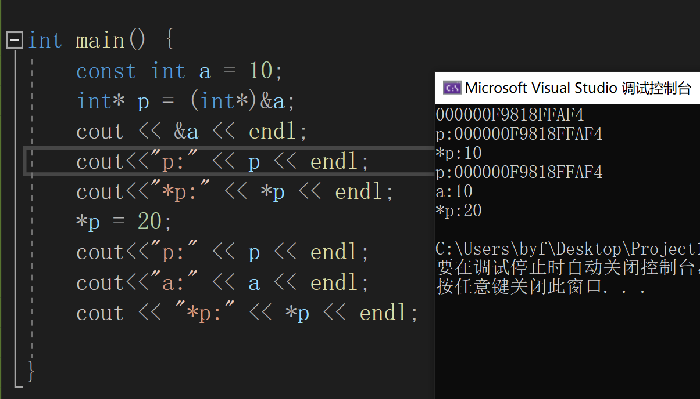
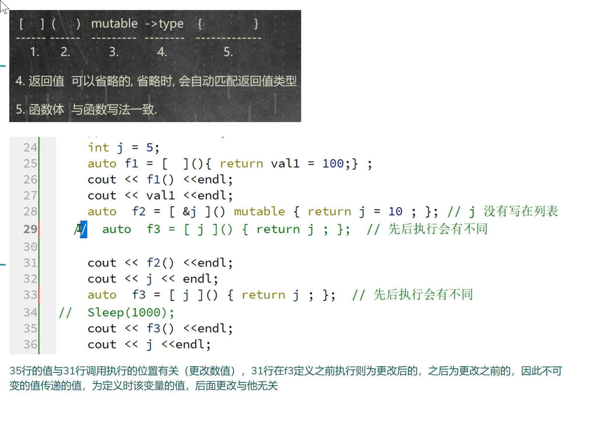
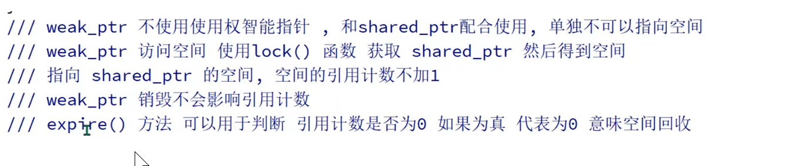

[TOC]

# 面向对象、面向过程

c采用面向过程的编程语言，将大型程序分解为一个个小型的易于编写模块，所有的模块有序的调动起来形成了一个程序的完整的运行链。C语言是一门面向过程的语言，更注重程序实现逻辑、怎么更好、更快、更直接的完成某功能

C语言是种面向过程编程的语言，在编写大型项目时，并不利于程序的复用性、扩展性，导致了在后期维护时带来了很多繁琐的工作，面临巨大挑战。

C++是一门面向对象编程的语言，把问题分解成各个对象，建立对象的目的不是为了完成一个步骤，而是为了描述某个事物在整个解决问题的步骤中的行为,更注重的是程序的整体设计，方便程序后期维、优化和管理

面向过程优点:性能比面向对象高

缺点:没有面向对象易维护、易复用、易扩展。

面向对象语言优点:易维护、易复用、易扩展

缺点:因为类调用时需要实例化，开销比较大，比较消耗资源，性能比面向过程低。

C++是由C衍生出来的一门语言，不但兼容包含了C语言还增加了一些新特性函数重载，类、继承、多态，支持泛型编程(模板函数、模板类)，强大的STL库等。

面向对象的三大特性:封装、继承、多态。

1.封装:将零散的数据和算法放到一个集合里，方便管理和使用。
2.复用性:公共功能、过程的抽象，体现为能被重复使用的类、方法，就要求我们针对某一类功能而不是针对某一个功能去设计。
3.扩展性:增加新的功能不影响原来已经封装好的功能。

# 基础

##### 输入输出

- 定义在文件iostream命名空间std中的ostream和istream对象中
- cout
    - << ：输出操作，本质上是函数
    - cout : 某个类型（ostream）的变量
    - endl : 本质上是一个函数
- cin
    - \>> ：输入操作，本质上是函数
    - cin : 某个类型（istream）的变量

- 命名空间
    - 作用域运算符::
        - 作用域::成员指明了成员的归属范围

##### new

- 指定申请空间的类型，自动根据类型计算所需要的空间大小，并返回内存空间地址
    - type * pointer = new type
- new,delete 与malloc(),free()区别
    - new，delete是关键字需要c++的编译器支持，malloc(),free()是函数需要头文件的支持
    - new不需要指定申请空间的大小，根据类型自动计算，new返回的时申请类型的地址，不需要强转。malloc()需要显示的指定申请空间的大小（字节），返回void*，需要强转成我们需要的类型
    - new申请空间的同时可以进行初始化，malloc()需要我们手动进行赋值
    - new申请类，结构体对象内存空间会自动调用构造函数，delete自动调用析构函数，单独的malloc()和free()则不会调用构造析构函数
    - 申请空间出错了，malloc返回NULL，new返回抛出异常：std==bad_alloc

##### BOOL和bool

- BOOL 本质上是一个 int 的别名， bool 本质上是c++中的一个关键字。
-  BOOL 定义的变量占用空间大小为4个字节，bool占用的空间大小为  1个字节

##### string

- c++提供的字符串存储，操作的类，需要头文件(string)并且打开命名空间std
- 支持初始化，赋值，比较，拼接，下标访问
- substr()截取字符串
    - str.substr(开始下标，截取长度)；//截取长度超过长度，则截取有效长度
- size（），length（）
- const char * c_str()
    - 将string转换为char
- char*可以直接给string赋值

##### 增强的范围for

-  适用于普通的数组，string，支持begin，end操作的容器

##### 函数重载

- c++中允许函数的参水列表指定默认值，而且这个默认值必须从右向左依次指定，不能间断，一般在函数声明中指定，在函数的定义中指定编译器可能不会抱错，但大多数情况下这是毫无意义的操作(定义在调用前面可以，后面会报错)
- 函数重载：在同一个作用域下，函数名一样，参数列表不同(参数类型，数量，顺序不同)。与返回类型无关（可以相同也可以不同）,函数重载 描述了多个函数之前的关系
- 函数重载
    - void fun(int a,int b =  10); void fun(int a,int b);
    - void fun(int * a) ; void fun(int const * a);
    - void fun(int a); void fun(int &a);
        - 区分：局部声明或函数指针
- 不是函数重载
    - void fun(const int a); void fun(int a);
    - void fun(int * a) ; void fun(int * const a);
- const修饰指针时，通过指针不能改变指向的值时（int cosnt * a），是函数重载

##### nullptr和NULL

- NULL是一个宏，在c++中被明确定义为整数0，这导致了整型与指针的混用。 nullptr的出现很好的解决这个问题，他被明确的定义为空指针
- nullptr是c++11新标准引入的的一个关键词，代表了空指针，如果出现了多个类型的空指针，依然会语以不明确，则需要强转来明确空指针类型
- 区别
    - NUll是宏替换的0，nullptr是关键字
    - 含义不同，nullptr代表是空指针，NULL代表的是整型数字

##### 引用

- &：给变量起别名，定义引用就要初始化，且不可以改变
- 引用与被引用的变量的是同一块内存空间，对引用操作就是对原始变量操作
- 引用不是值，不占用内存空间，且一旦被初始化就不能重新引用其他空间
- 不存在一个空引用，一旦被定义了就必须初始化
- int b = 10; int &c = b; int aa = 20; c = aa;//赋值操作，并不是重新引用，引用一旦引用了某个变量就不能重新引用其他变量了
- 引用和指针的区别
    - 引用一旦被引用了就要初始化，指针可不用初始化，指针可不用初始化（但是不推荐）
    - 引用初始化后就不能在重新引用其他的变量，空间。指针可以随意指向
    - 有NULL的指针，没有NULL的引用
    - 指针占据额外空间，引用不额外申请空间
    - 指针可以有多级，引用只能有一级
        - int a = 10;
            	int& b = a;
            	int& c = b;//还是a的空间
- int \*&p=a;正确,对指针a的引用
    int &\*p=a;错误

##### 函数传参

- 值传递，地址传递，引用传递
- 对于一些基本的数据类型值传递问题不大，但是一些复合类型来说，参数中的局部变量会占用空间（虽然函数调用结束会自动被收回），但是结构体，类会调用构造，析构，可能会出现浅拷贝的问题，所以复合类型最好不同值传递。如果想要在函数中修改外面的实参的值，则是使用引用和指针

##### sizeof

- 原理：指针偏移
    非数组：#define _sizeof(T) ((size_t)((T*)0 + 1))
    数组：#define array_sizeof(T) ( (size_t)(&T+1) - (size_t)(&T) )
- 入参：类型、变量名；
- 出参：size_t，即unsigned int
- 编译时（内部的赋值等语句的副作用不会发生，如sizeof(i++)）

- sizeof（类型）:分配当前类型的变量所占用的空间大小
- 根据C99规范， sizeof是一个编译时刻就起效果的运算符，在其内的任何运算都没有意义， sizeof(i++); 在编译的时候被翻译成 sizeof((i++的数据类型)) 也就是 sizeof(int); 不会执行i++了。 sizeof是运算符,它在编译时起作用，而不是运行时。 也就是说，在编译时，就得到了sizeof(int)，运行时，i++根本没有执行过。
- 注意事项
    1. 不能计算动态分配空间的大小；
    2. 作用于数组，编译时分配的数组空间大小；作用于类型，该类型所占空间大小；作用于指针，存储该指针所用空间的大小；作用于函数，决定于函数的返回值类型大小；（仅需要区分数组与类型，指针与函数是类型的特例）
    3. izeof 作用于结构体，基本类型相加，注意字节对齐；
    4. 各类型占用的空间大小与操作系统有关；
    5. C99特性，变长数组在运行时计算数组长度
        边长数组：int a;scanf("%d",&a);
                           int b[a];
        需要支持C99的编译器，vs都不支持不支持

##### 变长数组

1. 变长数组VLA只能是局部变量数组

2. 变长数组VLA不能在定义的时候进行初始化
3. 变长数组VLA必须是自动存储类别，即不能使用extern或static存储类别说明符
4. 变长数组VLA不等于动态数组，本质还是静态数组，也就是说，数组的长度在变量的整个生命周期中是不可变的
5. 由于变长数组只能是局部变量，且必须是自动存储类别，因此变长数组分配在栈上
6. 可变长数组对于多维数组也适用（如array\[a\]\[b\] ）

nt a=2;
int b=3;
char array1\[a\][b\] = {1,2,3,4,5,6}; //错误，变长数组VLA不能在定义的时候进行初始化
char array2\[a][b] = {{1,2,3},{4,5,6}}; //错误，变长数组VLA不能在定义的时候进行初始化
static char array3\[a][b]; //错误，变长数组VLA必须是自动存储类别

# 类

### 类的构成

- 数据（成员属性）
- 算法（成员函数）
- 关键字
    - class

### 成员访问修饰符：描述了类成员的访问控制，既所能使用的一个范围

- public（公有的）：对外开放的，在类内类外都可以使用
- protected（保护的）：在类内和子类中使用
- private（私有的）（默认）：只能在类内使用
- 对于类内的私有成员，我们可以提供接口按照一定的规则进行访问
- 修饰：变量，函数，构造，析构

### 构造函数

- 函数名：当前类名，类中默认提供的构造函数是无参的，没有返回值类型（并不是返回void）
- 类中默认提供的构造函数体代码为空
- 如果我们手动重构了任何的构造函数，编译器就不会提供默认的了
- 作用：初始化类中的成员属性
- 当定义对象时，自动调用构造函数
- 构造函数允许有多个，他们是函数重载的关系

### 析构函数

- 函数名：~类名 ， 无参 ， 编译器默认提供的析构函数体代码为空
- 如果我们手动重构了析构函数，编译器就不会提供默认的了
- 与构造函数不同的是析构函数只允许出现一个
- 作用：用来回收类中额外申请的空间
- 对象生命周期结束时，先调用析构，再回收对象的空间

### 结构体和类的区别

- 类成员属性和方法默认是私有的，结构体默认是公有的
- 当从基类，结构体中继承时，类的默认继承方式是私有的，结构体默认是公有的

### 类成员

- c++中规定，凡是一个独立的（非附属）对象都必须有非零的大小，所以一个空类，也不为零，应该为1，是用来在内存中占位的，不同的对象在内存中的地址不同
    - 空类的大小为1，起到 占位 ，标识作用
    - 当类中存在非静态成员变量时，占用的一个字节就不会存在了
- 成员属性:属于对象的，当定义对象的时候，成员属性才会真正存在于内存空间中.每个对象中都会存在属于自己的一份，多个的对象会有多个属性
- 类成员函数:属于类的，编译期存在，一个类只有一份，多个对象共享这一份函数
    - 与普通函数的区别
        - 所属的作用域不同，类成员函数标识了所属的类，必须通过对象调用（虽然可以通过空指针对象，但是必须得有）
        - 类成员函数编译器会默认加上一个隐藏的参数：this

- this指针
    -  编译器默认添加到类中非静态成员函数的隐藏的第一个参
    - 作用： 连接对象和成员之间的桥梁，在成员函数中都是通过this调用的其他的成员。
    - 平时在使用时，是否写this 指针都可以的
    - 类名 * const this
    - 当我们再用对象调用函数的时候，this指针指向了调用的对象

#### 静态成员

- 关键字：static
- 静态成员变量（属性）
    - 属于类，编译期存在，不参与类对象的空间占用，只有一份，所有对象共享这个变量
    - 注意:静态属性的存在与否和是否定义对象无关，所以并不是在构造函数中进行初始化
    - 在类外进行定义及初始化: 格式：类型 类名::属性名 = 初始化值
        - int A::a = 10;
    - 可以直接类名作用域直接调用，当有对象时，也可以用通过对象去调用
    - 静态成员不占类的空间,因此也不参与占用标识
- 静态成员函数
    - 属于类，编译期存在，一个类只有一份，所有对象共享同一份静态成员函数
    - 可以直接通过作用域去调用，也可以通过对象去调用

##### 与普通成员函数的区别

- 本质区别，静态成员函数没有隐藏的this指针，普通函数有
- 静态函数成员因为没有this指针，只能使用静态的变量和函数，普通函数都可以使用
- 静态成员函数有没有对象的可以调用，普通成员必须有对象才能调用

#### 常量 

- 关键字：const
- 常量特性：定义就必须初始化，一旦初始化后就不能修改其值（不能能通过正常手段修改）
    - 在C语言中，const变量只不过是修饰该变量名，它并不能使内存变为只读。也就是说，我们不能通过变量名再去操作这块内存。但是可以通过其它方法，如指针，通过指针是可以修改被const修饰的那块内存的。(c语言没有安全降级问题)
- 当类中有const修饰的变量时，在定义累的时候就要初始化，其实在初始化参数列表中完成的
    - 构造函数的函数体代码中进行的操作严格来说是赋值，而不是初始化
    - 构造函数先执行初始化参数列表，在执行函数体中的代码，普通变量也可以在初始化参数列表中初始化
    - 初始化参数列表，属于构造函数的一部分，用来真正的初始化成员属性
    - 初始化成员顺序为成员在类中定义的顺序，而不是写在初始化参数列表中的顺序
    - 写法：类名():变量名(初始化数)，变量名(初始化数) {}
        - CTest(int b) :m_a(10),m_b(b){ }
- 常量指针和指针常量
    - 常量指针：int const * p;
        - 指向常量的指针，通过指针不能修改指向的空间的值，但是可以改变指向
    - 指针常量:int * const p = &a;
        - 这个指针是常量，不能改变指向，但是可以改变指向空间的数值
    - 常量指针升降级问题
        - 安全级别可以提升，但是不能降级
        - 指向空间内的值能不能改的升降操作
            - \*前面的const的有没有，而*后面的const不涉及升降操作
                - int a = 10; int* const p2 = &a;//指针常数 int* p3 = p2;// int const* p1 = p2;
                    - 	
                - c语言是常变量，c++是常量

#### 常函数

- 类中成员函数参数列表后面有const修饰时为常函数
    - 保护类中的成员变量，限制修改
    - 特性：不能修改类中的非静态成员，只能查看
        - Test* const this(一般函数)  -> const CTest* const this（常函数）
        - 但是静态成员不受限制，因为静态成员属于类，不属于对象，并不在const约束的范围内
    - 在常函数中可以查看普通的变量，常量，静态变量等，也可以调用其他的常函数，但是不能调用普通的成员函数，因为this指针类型不相同
        - CTest* const this = const CTest * const this,这是指针安全级别降级的操作
    - 普通成员函数可以调用常函数，这个是指针安全级别升级的操作
- 常量对象
    - 使用const修饰对象（const CTest tst；）不能调用普通的成员函数，只能调用常函数


### 类之间的关系

#### 横向关系

- 组合（复合）is a part of
    - 包含于被包含，整体与部分，往往具有相同的生命周期
- 依赖 use a
    - 对象的某种行为依赖与另一个类对象，只有在完成某个功能的时候才能用到，必不可少，依赖之间没有生命周期的约束关系
        - 作为函数参数存在
- 关联 has a
    - 平等关系，拥有但不占有，完成某个功能与被关联对象有关，但是可有可无。两者之间没有生命周期的约束关系，被关联对象生命周期由谁创建由谁维护。只要二者同意，可以随时解除或者进行关联，被关联着还可以被其他对象关联，既关联是可以共享的
        - 作为指针存在
- 聚合owns a
    - 多个被聚合的对象聚集起来形成一个大整体
        - 数组

#### 纵向关系：继承

- 被继承的类叫基类（父类），继承的类叫派生类（子类）

- class CSon :public CFather {}

- 通过继承关系，子类可以使用父类的成员。如果子类和父类有同名的成员，默认使用子类的
    - 类名::可以显示的使用父类的成员
    
- 子类对象内存布局： 先父类成员属性，子类自己的成员属性。

- 继承下的构造析构执行的顺序
    - 先父类构造 -> 子类构造
        - 父类构造是在子类构造的初始化参数列表中去调用
            - 子类创建对象时，调用子类的构造函数（这里并不是直接的执行父类构造函数），但是要先执行初始化参数列表，在初始化参数列表中默认调用父类的无参构造，初始化父类成员，如果父类只有带参的构造，在子类的初始化参数列表中必须显示的指定父类构造进行初始化
                - CSon(int a,int ): CFather(a) {}
        - 父类成员在父类的构造中进行初始化，不要在子类构造中赋值
    - 执行析构的顺序：先子类 -> 后父类
        - 因为是定义的子类 对象，其生命周期优先匹配自己类（子类）的析构函数，回收对象内存空间，其中包含了父类匿名的对象，回收父类匿名对象前，会调用父类的析构函数。
    

##### 优点

- 将一些功能相似的类中公共的成员，抽离出来放到一个类中，作为一个父类，各个子类只需要继承这个父类，也就继承了父类中的成员。
- 如果是增加公共的成员，只需要在父类中增加一份即可。
- 如果是增加新的子类，公共方法不需要重复写了。
- 增加了程序代码的复用性，扩展性，灵活性。

- 继承方式

    - | 父类      | public    | protected | private    |
        | --------- | --------- | --------- | ---------- |
        | public    | public    | protected | 不可访问的 |
        | protected | protected | protected | 不可访问   |
        | private   | private   | private   | 不可访问   |


##### 隐藏：子类和父类出现了同名的成员，称之为隐藏

- 即便参数列表不同也不是函数重载，因为作用域不同，因此不能自动匹配

##### 父类的指针指向子类的对象

- 继承关系下，父类的指针可以不通过强转直接指向子类的对象
- 父类的指针，使用范围只是父类的成员
    - 既虽然指向了子类，但是子类有而父类没有的成员不能调用
    - 可以将父类指针强转为子类指针，但是该方法为取巧方法，并不通用
- 父类的指针统一多种子类类型，提高程序代码的复用性 和扩展性

##### 类成员函数指针

- 调用函数可以通过函数名直接调用，通过函数指针间接调用


##### 通过函数指针调用的好处

- 真正的函数指针可以将实现同一功能的多个模块统一起来标识，使系统结构更加清晰，后期更容易维护

- 或者也可以归纳为：便于分层设计，利于系统抽象，降低耦合度以及使接口与现实分开，提高代码复用性，扩展性


##### 定义函数指针变量

- void (\*p_fun)(int) = &fun;//定义变量并初始化 p_fun = &fun1;//赋值 (*p_fun)(10);//间接调用
- 通过typedef优化
    - typedef void(*P_FUN)(int); P_FUN p_fun = &fun;

- ```c++
    void (CTest::*p_fun)() = &CTest::show;//定义类成员函数指针并初始化，注意：& 和 类名作用域都不能省略
    typedef void (CTest::\*P_FUN)(); //使用typedef进行优化
    P_FUN p_fun2 = &CTest::show; 
    CTest  tst; 
    CTest* past = new CTest; 
    (tst.*p_fun2)();//普通对象通过指针调用类成员函数
    (past->*p_fun2)();//指针对象通过指针调用类成员函数
    ```

- 可以通过类成员函数指针来模拟实现多态

    - ```
        class CPeople {}; 
        class CYellow : public CPeople { 
        public:           
        	void Eat() {                  
        		cout<<" asdf"<<endl;           
        	} 
        }; 
        int main() {     
            CPeople* pPeo = new CYellopw;     
            //pPeo->Eat();  //不能直接调用     
            void (CPeople::* p_fun)() = (void (CPeople::*)())&CYellow::Eat;//通过强转指向子类的函数     (pPeo->*p_fun)(); 
        }
        ```

        

### 多态

- 在C++中，有两种多态性：编译期多态性（静态多态）和运行期多态性（动态多态）
- 编译期多态
    - 函数重载
        - 同名函数可以根据不同的参数列表进行重载，使得程序员可以使用相同的函数名来实现不同的操作。编译器会根据参数的类型，顺序和个数来选择调用哪个函数。
    - 模板技术 
        - 模板允许程序员定义通用的函数或类，使得函数或类可以适用于多种数据类型和数据结构。编译器会根据函数和模板的实际参数类型来生成相应的代码。
- 运行期多态：继承和虚函数
    - 派生类可以继承父类的属性和方法。当父类声明函数为虚函数后，当派生类对象被赋值给父类指针或引用时，会发生动态绑定，根据实际对象的类型来调用虚函数。
- 多态:相同的行为方式导致了不同的行为结果，同一行语句展现了多种不同的表现形态，多态性
- 父类的指针可以指向任何继承于该类的子类，且父类指针具有子类对象的行为，多种子类表现为多种形态由父类的指针进行统一管理，那么这个父类的指针就具有了多种形态

#### C++直接支持多态条件

- 在继承关系下，用父类的指针(引用) 指向子类的对象。
- 父类中存在虚函数（virtual修饰），且子类重写父类中的 虚函数。

- 重写： 子类定义了和父类一模一样的虚函数，称为虚函数重写
- 一旦子类的函数重写了父类的虚函数，即使不加关键字virtual，也会被认为是虚函数
- 虚函数，虚函数指针，虚函数列表
    - __vfptr	:   虚函数指针
        - void** 二级指针，属于对象的，定义对象的时候才会存在，在对象首地址会多开辟指针大小的空间
        - 多个对象会有多份的虚函数指针,多个虚函数指针指向了同一块内存空间（函数指针数组）
        - 如果一个类中定义了虚函数，编译器会默认添加成员属性 __vfptr，在定义对象时，执行构造函数的初始化参数列表给虚函数指针 进行初始化。指向了通一个虚函数指针数组（vftable 虚函数列表）
    - vftable 虚函数列表
        - 函数指针数组 ,数组的每一个元素为类中虚函数的地址。属于类的，编译期存在。所有对象共享
        - 必须通过真实存在的对象调用，无对象或空指针无法调用虚函数
    - 虚函数调用流程
        - 定义一个对象会包含__vfptr，通过对象中的虚函数指针找到虚函数列表
        - 通过下标定义到具体的虚函数地址，通过地址找到虚函数的执行入口，调用执行函数。
    - 虚函数与普通成员函数的区别
        - 调用流程不同
        - 效率不同，虚函数调用流程复杂，效率低，普通函数流程简单，效率高。
        - 使用场景不同，虚函数的使用场景为了实现多态

##### 多态实现的原理

- 虚函数指针，在对象内存空间首地址，指针大小空间,指向的是子类的虚函数列表，new哪个对象（哪个子类）最终指向的就是那个类的虚函数列表。
- 前提：虚函数列表属于类的，父类和子类都有各自的虚函数列表，__vfptr属于对象的，每个对象都有各自的__vfptr。
- 原理
    - 由于子类继承父类，不但继承了父类的成员，也会继承父类的虚函数列表
    - 编译器会检查子类是否有重写父类的虚函数，如果有，在子类的虚函数列表中会替换掉父类的虚函数，称之为覆盖，覆盖后指向了子类的虚函数
    - 如果子类没有重写的父类虚函数，父类虚函数会保留在子函数的虚函数列表中
    - 如果子类定义了独有的虚函数，按照顺序依次添加到虚函数列表结尾
- 普通函数不会出现在虚函数列表中
- 流程：父类指针指向子类对象，__vfptr在子类的初始化参数列表中初始化，指向子类的虚函数列表，申请哪个子类对象__vfptr就指向那个子类的虚函数列表。调用虚函数执行虚函数流程，则实现了多态

##### 虚析构

- 问题： 继承多态下，父类指针指向子类，最后回收空间按照父类的指针类型调用的析构函数，所以只会调用父类的析构，如果子类中有额外申请的空间，子类析构没有执行，额外申请的空间没有被回收，导致内存泄漏
- 解决： 虚析构，父类的析构变为虚析构之后，子类会重写父类的虚析构函数，调用析构会发生多态行为，从而调用子类的析构，在回收父类匿名对象内存空间时，再去调用父类的析构。
- 再用多态时，父类的析构一定为虚析构

- 纯虚函数
    - 特点：当前类不必实现，而子类必须重写实现纯虚函数
    - 纯虚函数：virtual 返回值 函数名(形参列表) = 0;
    - 包含纯虚函数的类为抽象类，抽象类不能实例化对象，继承这个抽象类的叫具体类，具体类必须重写定义抽象类里面的所有纯虚函数

##### 多态的缺点

- 效率：虚函数调用流程复杂，效率低，速度慢
- 空间：虚函数指针占用空间，多对象会有多个虚函数指针，虚函数列表会随着继承层级递增，只增不减
- 安全：类中的私有函数，不能为虚函数，否则有安全隐患
    - 类是编译器期概念，包含了访问权限，成员作用域。而对象的作用域是运行期，它包含类的实例，引用，和指针
        - class CFather{ public:      virtual void fun() {           cout<<"CFather"<<endl;       } }; class CSon:public CFather{ private:       virtual void fun() {            cout<<"CSon"<<endl;      } }; CFather * pFa = new CSon; pFa->fun();//成功调用子类的虚函数
        - 编译器在检查代码时，他认为pFa->fun()调用是父类中public属性的函数，那么自然是通过编译器了。
        - 但是在运行期时由于多态的作用，结果调用的是子类的fun函数，即使子类的fun函数是private，但是由于访问修饰符是编译期的限制，所以在运行时无效，子类的fun函数自然能调用

- 重载操作符
    - 概念
        - 本质上是一个函数，告诉编译器 当遇到这个操作符的时候，调用重载操作符函数来完成操作符的功能，是对原有操作符功能的补充、扩展，并不是推翻原有的功能。
    - 关键字
        - operator
    - 返回值
        - 有，方便继续和其他操作符去操作
    - 不允许有默认值
    - 分为两类
        - 类内重载
            - 作为类成员函数，需要对象调用，使用场景需要根据函数的参数一致（包括类型和顺序），注意类内的重载的操作符函数有隐藏的this指针作为第一个参数
            - 函数名： operator后接要重载的操作符，参数要与实际的使用情况保持一致
            - 可以直接使用操作符，也可以先是通过对象调用重载操作符
                - 类内：int operator+(int a) {                   return m_a + a;            }
                - int a = tst+20;
                - int b = tst.operator+(20);
            - 为了区分右++，增加一个整型的参数，只是为了区分，除此之外毫无意义
                - int operator++();//左++ int operator++(int a)//右++
                - tst++； ++tst；
        - 类外重载
            - 在类重载重载，this作为函数第一个参数，顺序不可变，在类外重载会比类内多一个参数，而且顺序相对来说可以不固定
            - 在类外重载至少应当包含一个自定义类型
    - 注意在类外重载是否和类内重载 在使用时，产生二义性的问题
        - 在类中定义了一个，类外也定义一个，并且this指针在第一个位置，其他与类内一直，长生歧义
    - 自定义重载输入，输出操作符一般在类外重载
        - 参数为类，结构体类型，最好用引用而非值传递
        - istream& operator>>(istream& is, CTest& tst) { is >> tst.m_d; return is; }
        - ostream & operator<<(ostream& os, CTest& tst) { os << tst.m_d; return os; }
    - 只能在类内重载： =  []   ()   ->
    - 注意
        - 同一操作符，写在不同位置代表不同含义，*p 和 a*b，那么重载这个这个操作符需要注意参数的数量，顺序不同代表不同的含义
            - //类内重载 int operator*();// 间接引用 int operator*(int); // 乘法
        - 不能重载的操作符
            - 长度运算符sizeof
            - 条件运算符：？
            - 成员选择符     "."
            - 作用域运算符 ::
        - 只能在类内重载的
            - 赋值=
            - 下标[]
            - 调用（）
            - 成员指向->
        - 重载操作符不能改表操作符的用法，原来有几个操作数，操作数在左边还是右边，这些都不会改变
        - 运算操作符不能有默认的参数，否则就改变了运算操作数的个数
        - 重载操作符不能改变运算符的优先级和结合性
        - 不能创建新的运算符
- 对象类型转换
    - 重载操作符operator=，能让其他的类型赋值到当前类对象中，但是反过来写则会报错，类型不匹配，operator=只能在类内重载
    - 可以重载某个类型，这样定义该类对象就可以像这个类型一样去使用了
    - 函数格式:  operator type() {   return type_value; }
        - 返回值类型要和type一致
    - 函数无参数，无返回值，但是有return，且return的变量类型和重载的类型一致
    - 如果同时存在重载操作符和重载类型，那么优先匹配重载的操作符
        - int a = tst + 10;//operator+ a = 10 + tst; // operator int a = tst;// operator int
    - 也可以显示的调用其他类型转换函数
        - int a = tst.operator int() + 10;//operator int

##### 拷贝构造

- 转换构造
    - 构造函数只有一个参数，可以将该其他类型自动转换为当前类型，这个类型为隐士类型转换。在使用等号初始化或赋值时自动转换
    - CTest(int a) {} CTest(int a,int b = 0) {} CTest(int a = 0,int b = 0) {} 这些时转换构造函数
    - 关键字explicit
        - 禁止发生隐士类型转换
    - explicit CTest(int a = 0,int b = 0) {}//禁止发生隐士类型转换 CTest(int a,int b) {} //不是转换构造
    - 类中有转换构造 CTest tst = 20;//合法操作，发生隐式类型转换，将int类型转换为CTest类型 tst = 30；//合法操作，发生隐式类型转换
    - 如果是多个参数且无默认值时，则不能自动隐士类型转换。
- 拷贝构造
    - 编译器默认提供的一种特殊的构造函数，在空类中与默认的无参构造函数并存，是众多构造函数中的一种
    - 参数为当前类对象的引用。与默认无参构造不同，其函数体代码一般不为空，操作为：参数中对象成员依次给this对象成员进行初始化
    - 当我们手动重构拷贝构造函数时，编译器不会提供默认拷贝构造函数，也不会存在默认的无参构造函数
    - 一个类对象给另一个对象初始化时，会调用拷贝构造函数
    - 默认拷贝构造是浅拷贝： 当类中存在指针成员并且指向了一个new出来的具体空间，拷贝构造函数只是将两个指针里存储的地址进行拷贝，并不会拷贝一个空间出来，这样就导致课多个对象里的指针指向了同一个空间，导致出现两个问题
        - 当其中一个对象通过指针修改其指向空间的值，那么其他对象再使用就是修改之后的值了
        - 如果是new出来的空间，那么导致多个对象回收同一块内存空间，引起了非法操作错误
    - 浅拷贝解决办法：深拷贝
        - 不是固定写法，而是解决方法，手动重构拷贝构造函数，针对于指针成员开辟属于自己空间，同时将值拷贝过来。
            - CTest (const CTest &tst) {   //深拷贝   if(tst.m_p)         m_p = new int(*tst.m_p);    else m_p = nullptr;
    - 在某些情况下，可以使用指针或者引用可以避免对象的值传递，也避免了浅拷贝问题
- 默认operator=
    - 空类中编译器中也会提供一个operator=函数，参数和返回值为当前对象的引用，如果我们手动重构了编译器也不会给我们提供了
        - CTest& operator=(const CTest& tst){}
    - 当一个类对象给类的另一个对象赋值时，会调用operator=函数
    - 默认的operator=函数不为空，与浅拷贝一样，因此也会出问题，手动改为深拷贝
- 空类存在的默认函数
    - 默认无参构造函数
    - 默认拷贝构造
    - 默认operator=
    - 默认析构函数

- 设计模式
    - 单例模式
        - 创建型模式，3个要点
            - 当前类最多只能创建一个实列
            - 他必须自己创建这个实例（而不是调用者创建）
            - 他必须自己像整个系统提供全局访问点访问这个实列
        - 构造私有化保证了对象不能在类外创建
        - 懒汉式
            - 不会自动初始化对象，直到第一次调用获取实列接口时，才会创建对象执行构造，初始化对象空间，一种时间换空间的做法，实列最后需要手动销毁
            - 实例1:对象的生命周期可控，在不需要的时候可以手动回收对象空间，节省资源，避免浪费
                - class CSingleton { private: CSingleton():m_a(1) {} 	CSingleton(const CSingleton&) = delete;  //弃用拷贝构造 	~CSingleton() { }  public: //在多线程下，可能会创建出多个对象，待解决 static CSingleton* GetSingleton() { 	//1. 加锁 	if (!m_pSin) { 		m_pSin = new CSingleton; 	} 	//2. 解锁 	return  m_pSin; } 	static CSingleton* DestorySingleton(CSingleton* &p) { 		if (p) { 		delete p;                         p = nullptr;                         m_pSin = nullptr; 	} 	} 	int m_a; };
            - 实列2：自动回收对象空间
                - class CSingleton { private: CSingleton():m_a(1) {} 	CSingleton(const CSingleton&) = delete;  //弃用拷贝构造 	~CSingleton() { } 	static CSingleton* m_pSin; 	class Destory { 	static Destory des; 	~Destory() { 		if (m_pSin) { 			delete m_pSin; 			m_pSin = nullptr; 		} 	} }; public: //在多线程下，可能会创建出多个对象，待解决 static CSingleton* GetSingleton() { 	//1. 加锁 	if (!m_pSin) { 		m_pSin = new CSingleton; 	} 	//2. 解锁 	return  m_pSin; } 	int m_a; };
            - 实列3：第一次调用公共接口创建唯一实例，且不需要手动回收，直到程序退出时资源才被系统回收
                - class CSingleton { private: CSingleton() :m_a(1) {} 	CSingleton(const CSingleton&) = delete;  //弃用拷贝构造 	~CSingleton() { } public: static CSingleton* GetSingleton() { 	static CSingleton sin; 	return &sin; } int m_a; };
        - 饿汉式
            - 在程序创建之初自动的创建了对象，他是一个全局变量，生命周期直到程序结束，所以不需要提供销毁对象的方法。是一种空间换时间的做法。不存在多线程下的安全问题
            - class CSingleton { private: CSingleton() :m_a(1) {} CSingleton(const CSingleton&) = delete;  //弃用拷贝构造 ~CSingleton() { } 	static CSingleton m_sin; public: static CSingleton* GetSingleton() { 	return &m_sin; } int m_a; };
        - 单例模式优点
            - 单例模式提供了严格的对唯一实例的创建，访问和销毁，安全性高
            - 单例模式的实现可以节省系统资源
    - 工厂模式
        - 主要用来集中创建对象，如果在任何的地方创建对象那就造成了类和方法之间的耦合如果更换对象那么在所有使用到的地方都要修改一遍， 不利于后期的维护，也违背了开闭设计原则，如果使用工厂来创建对象，那么就彻底了解耦合了，如果要修改只需要修改工厂即可。工厂最大的优势：解耦
        - 简单工厂
            - 简单工厂提供了一个集中创建所有类型产品的方法，根据对应的标识创建对应的方法
        - 工厂方法
        - 抽象工厂
        - 总结
            - 对于简单工厂和工厂方法来说，两者的使用方法实际上一样的，如果对于产品的分类和名称是确定的，数量是相固定的，推荐使用简单工厂模式
            - 抽象工厂用来解决相对复杂的问题，适用于一系列，大批量的对象生产
- 模板
    - 泛型模板
        - 通用的数据类型和算法，将算法从数据结构中抽象出来，程序写的尽可能通用，用不变的代码完成一个可变的算法。屏蔽掉数据和操作数据的细节，让算法更为通用，让编程者个多的关注算法的结构，而不是在算法中处理不同的数据类型，是一种不考虑数据类型的编程方式
        - 模板
            - template <typename Type>
            - 关键字
                - template
                    - 告诉编译器要定义一个模板
                    - <> 中是模板的参数列表
                - typename
                    - 可以看作变量的类型名，该变量接受类型作为其值，把type看作变量的名称
    - 函数模板
        - 常规使用
            - 建立一个通用的函数模板，他所用到的数据的类型（返回值，形参，局部变量）用一个虚拟的类型（模板类型）代替，实际调用时编程器根据传入的实参来逆退出真正的类型，生出对应的具体函数。模板函数不仅将数据的值作为变化的量，类型也被参数化
            - template<typename T> T fun(T a,T b); int a = 10,int b = 20; fun(a,b); //其中T自动推导出为int 类型
                - T为模板参数
                - 编译器由函数模板自动生成模板函数的过程叫模板实例化
        - 显示的指定及默认值
            - 如果函数的参数中并未使用模板类型，那么编译器无法自动推导，这时就需要手动显示的指定模板类型
                - //再调用函数时，显示的指定 add<long,long>(a,b);//此时 模板类型T 为long类型
            - 还可以指定模板类型的默认类型
                - template<typename T = long> void fun(); fun();//fun<long> T采用默认值 fun<int>(); //fun<int> T 采用显示指定的类型
            - 模板参数类型选择的优先级
                - 手动显示指定 > 编译器根据实参自动推导 > 模板类型默认值
                    - template<typename T = int>  void fun(T t); double d = 12.3; fun<char> (d);  //T == char fun(d); //T == double
    - 多模板参数
        - 模板类型可以指定多个，用逗号分开，每个模板类型都需要关键字typename修饰。
            - template<typename T,typename K>
        - 也就可以根据实参进行自动推导，不同于函数参数的默认值，模板参数默认值指定的顺序可以是任意的没有强制的顺序要求，但在调用的函数时显式指定模板类型时必须从左向右依次指定，不能有间断
            - template<typename T,typename K = int,typename M> void fun(); fun<int,double,char>();//从左到右依次传递 //一般编译器能够自动推导出的模板参数放于最后，剩余的模板如果有默认值的放于中间，无默认值得放于前面
            - template<typename T,typename K = long,typename M> void fun(M &m); fun<double>(10); //fun<double,long,int> fun<double,char>(10);//fun<double,char,int>
    - 模板函数的声明和定义
        - 如果函数的声明和定义分开，那么声明和定义处都需要加上模板，如果模板存在默认类型，那么只在函数声明时指定即可
            - //函数声明} template <typename T = char>  void fun(); //函数定义 template <typename T> //默认类型去掉 void fun() {....}
        - 模板函数的定义并不是真正的函数，他们不能单独编译，所以不能将模板函数单独放到源文件中，模板必须与特定的模板实例化请求一起使用，最好的办法时模板函数的声明和定义放在一起
    - 类模板
        - 与函数模板差不多，但是在定义对象时，必须使用<>显示的指定模板类型
            - template<typename T> //定义一个类模板 class CTest{}；//模板类 CTest<int> tst; //定义对象
        - 模板类型可以替换类内的任意地方定义的类型，包括成员属性类型，成员函数。类中成员属性若为模板类型，我们可以定义带参数的构造，让调用者去指定初始化值
        - 类模板可以有多个模板类型，且可以指定默认的模板参数，规则是从右往左依次指定不能间断(从后往前)，在定义对象时从左向右指定，如果不指定板参数，将使用默认的。
        - 如果模板类中的成员函数在类中声明，类外实现时，定义的函数也要加上模板
        - 如果类模板指定了默认的类型，为了避免歧义，默认的模板类型应当去掉。
        - 如果在模板类中声明、类外定义的成员函数存在函数模板，那么在定义的时，两个模板都需要指定
- STL
    - 重要特点：数据结构和算法分离
    - STL六大组件
        - 容器
            - 序列性容器
                - 保持插入元素的原始性顺序。允许指定在容器中插入元素的位置。每个元素都有固定的位置，取决于插入时机和地点，和元素值无关。如：链表（list），向量（vector），双端队列（deque）
                    - list
                        - 头文件
                            - list
                        - list(size_type Count)。list(size_type Count,const Type & val) //构造链表长度并设置初始值。有默认值
                        - 头添加
                            - push_back()
                        - 尾添加
                            - push_back()
                        - 删除头节点
                            - pop_front()
                        - 删除尾节点
                            - pop_back()
                        - begin():返回头节点的迭代器
                        - end()：返回无效的尾节点的迭代器
                        - front()：返回头节点中的值
                        - back(); 返回为尾节点的值
                        - remove(const Type& val):将值为val的所有节点删除
                        - unique(): 将连续而相同的节点删除只剩一个
                        - sort():对链表进行排序，默认升序。如果要指定规则，需要指定排序规则函数。bool func(type,type)；或者greater()降序，less()升序
                        - reverse():将链表翻转
                        - splice(iterator where , list & right):将right链表整个结合到另一个链表where位置之前，这是一个“剪切”操作，right链表将为空
                        - splice(iterator where,list &right,iterator First) : 将right链表的first位置结合到this链表的where位置之前，这是一个“剪切”操作，this和right可以为同一个链表
                        - splice(iterator where,list& right,iterator First,iterator fast):将链表right位置到fast位置的一段元素[first,fast),不包含fast，结合到this链表的where位置之前，这是一个“剪切”操作，this和right可以为同一个链表，但是where不能位于[first,fast)内
                        - merge(list& right,Traits Comp);将链表right合并到this链表上，this和tight链表必须经过排序，两者都为递增或者递减，comp描述了定增合并还是递减合并，bool fun(type,type)；或greater()降序 ，less升序，这是一个“剪切”操作，right将为空表
                        - swap(list& right):交换两个链表
                        - 迭代遍历链表
                            - list<int>::iterator itr = lst.begin();//定义迭代器指向头节点 while(ite != lst.end()) {  //不等于链表的尾节点      cout<<*ite<<" ";      //operator*        ite++;                   // operator++ }
                        - 插入
                            - insert()
                                - ite2 = lst.insert(ite1,value);//在ite1指定位置之前插入元素value并返回插入元素的迭代器
                        - 删除
                            - erase()
                                - ite2 = lst.erase(ite1); //删除ite1指向的节点，ite1将失效不可用，返回删除节点的下一个节点
                                - ite = lst.erase(ite); //多数情况下，用于删除的迭代器也可以承接其返回值，自带++效果
                        - 获取首位节点中元素的值。注意：end() 返回的是无效的尾节点，不能对其进行间接引用。
                            - lst.front(); //*(lst.begin());
                            - lst.end(); //*(--lst.end());
                        - 可以用增强的范围for循环遍历链表
                            - for(int n : lst) {  cout<<v<<" "; }
                            - 加引用可以修改节点里的值
                                - for(int &v: lst) {    v = value; }
                        - empty()
                            - 判断当前链表是否为空（bool），空返回true，非空返回false
                        - size()
                            - 获取链表的长度
                        - clear()
                            - 清空链表
                    - vector
                        - 类似于数组，但是其容量会随着需求增长。 向量在尾部的push和pop操作时间是恒定的。在向量的中间insert和erase元素需要线性时间，在序列结尾插入，删除操作比开始位置位置性能要优越
                        - 当向量元素增加超过当前的存储容量时，会发生重新分配操作。重载了[]操作符，就意味着它可以向数组一样使用[下标]访问元素
                        - 特点:数据的存储访问比较方便，可以向数组一样使用[index]访问修改，适用于对元素修改和查看比较多的情况，对于inser和erase比较多的操作，很影响效率，不建议使用vector
                        - 头文件
                            - \#include<vector>
                        - vector<size_type Count)。vector(size_type Count,const type& val)。构造函数，指定长度，并设置初始值，有默认值
                        - begin(),end()
                            - 返回向量头尾元素的迭代器
                        - front(),back()
                            - 返回头尾元素的值
                        - size()
                            - 返回向量的是使用量
                        - capacity()
                            - 返回向量的容量
                        - push_back(),pop_back()
                            - 向量尾添加删除，当用push_back向vector尾部加元素的时候，如果当前的空间不足，会重新申请一块更大的空间。pop_back()删除时，使用量减少，但容量不会减少。不同于list，vector并没有提供push_front()，pop_front()。
                        - insert()
                            - insert(const iterator where,const type& val)
                                - 向量的某个位置之前插入指定值
                            - insert(cosnt iterator where,size_type Count,const type & val)
                                - 向量的某个位置插入count个val
                            - 返回插入元素的迭代器，size()增加
                        - erase(cosnt iterator where)
                            - size()减少，capacity() 不变
                        - clear()
                            - size()减少，capacity() 不变
                        - empty()
                            - 使用量是否为空
                        - resize(size_type Newsize),resize(size_type newsize,type val)
                            - 为向量指定新的使用量，如果使用量减少，元素按顺序截取，但容量不变，如果使用量增加大于原容量，则扩展容量，并可以指定新扩展元素的值
                        - swap()
                    - list和vector对比
                        - vector是连续性空间，顺序存储，list链式结构，链式存储
                        - vector在非尾部插入，删除节点会导致其他元素的拷贝移动，list则不会影响其他节点元素
                        - vector一次性分配好内存，使用量不够时，申请内存重新分配。list每次插入新节点时都会申请内存
                        - vector随机访问性能好，插入删除性能差，list随机访问性能差，插入删除性能好
                        - vector具有容量和使用量的概念，而list只有使用量(长度)概念
                    - deque (双端队列)
                        - 没有容量的概念。他是动态以分段连续空间组合而成，一旦有必要在deque的前端和尾端增加新空间，串联在整个deque的头端或尾端，deque的迭代不是普通的指针，其复杂程度比vector复杂得多。除非必要，我们尽量选择使用vector而非deque
                        - deque是一种双向开口地 连续空间，可以在头尾两端分别做元素的插入和删除操作
                        - 头文件
                            - \#include<deque>
                        - deque<size_type Count)。deque(size_type Count,const type& val)。构造函数，指定长度，并设置初始值，有默认值
                        - push_back(),push_front(),pop_back(),pop_front()
                        - begin(),end(),front(),erase(),insert()
                        - size(),empty(),clear(),支持[]下标访问
            - 关联性容器
                - 元素的位置取决于特定的排序规则和插入顺序无关，map，hash-map，set
                    - map
                        - map : 映射表 ，map  的每一个元素称之尾键值对pair，键值（key）和  实值 (value) ,要求键值不允许重复（唯一），可以根据键值自动做排序（默认升序）
                        - 查找效率：O（long（2，n））
                        - 内部实现为红黑树
                        - 头文件
                            - \#include<map>
                        - 定义：map<key,value> mm;
                            - map<char,int> mm;
                        - 添加：mm[key] = value;
                            - mm['b'] = 1; mm['d'] = 2;
                        - 使用函数出入元素，参数为键值对pair
                            - mm.insert(pair<char,int>('e',5));
                        -  迭代器遍历map
                            - map<char,int>::iterator ite = mm.begin(); while(ite != mm.end()) {    cout<<ite->first<<"-"<< ite->second<<" ";//first对应键值，second对应实值    ite++; } //自动按照键值进行排序
                        - [] 添加时当键值已经存在时，修改实值
                        - erase()
                            - 删除，一样返回删除元素的下一个
                        - 增强的范围for循环遍历
                            - for(pair<char,int> pr : mm) {      cout<<pr.first<<"-" <<pr.second<<" "; }
                            - 引用修改
                                - for(pair<const char,int> &pr : mm) {//注意：因为键值不能修改，const不能省略，否则报错      if(pr.first == ) {              pr.second = value;        } }
                        - count() 统计
                            - 统计某个键值出现的次数，map键值唯一，可以用来判断某个键值是否存在
                        - iterator find(const key& key),按键值对查找，没找到返回end()
                        - upper_bound(const Key& key)
                            - 返回大于该键值的map的迭代器
                        - lower_bound(const Key& key)
                            - 返回该键值或者大于该键值的map的迭代器
                    - set集合
                        - 所有元素都会根据元素的键值自动被排序，set的元素不像map那样可以同时拥有实值和键值，set元素的键值就是实值，实值就是键值。set不允许两个相同元素有两个相同键值，因为set元素值就是键值，关系到set元素的排列规则。如果任意改变set的元素值，会严重的破坏set组织
                        - 头文件
                            - \#include<set>
                        - begin(),end()
                        - clear(),size(),empty()
                        - find(),upper_bound(),lower_bound()
                    - hash_map哈希表
                        - 基于hash table(哈希表)，数据的存储和查找效率非常高，几乎可以看作常量时间，相应的代价是消耗更多的内存。使用一个较大的数组来存储元素，经过算法，使得每个元素与数组下标有唯一的对应关系，查找时直接定位。
                        - 头文件
                            - \#include<hash_map>
                        - 查找效率：O（1）
                        - begin(),end()
                        - erase()
                        - pair<iterator,bool> insert(const value_type& val)
                            - 插入一个元素，如果key值重复，则插入失败。
                        - find()
            - 容器类自动申请和释放内存，无序new和delete操作
        - 迭代
            - 反向迭代器：reverse_iterator,rbegin(),rend()
            - base()
                - 反向迭代器转正向迭代器
                - 转完后，空间整体向后移动，因此，指向的位置为原来的下一个
        - 算法
            - STL中算法位于同文件<algorithm>和<numeric>文件中
            - for_erach(iterator beg,iterator end,_func)
                - 起始到结束位置的元素遍历，并且每个元素作为参数执行函数
            - count(iterator beg,iterator end,const type& val)
                - 统计容器范围内中等于value元素的个数
            - bool equal(iterator beg1,iterator end1,iterator beg2)
                - 前两该参数范围内的元素，与beg2开始的元素组个比较是否相等，相等返回true，不等false。beg2后面个数不能小于范围内元素
            - inputIterator find(InputIterator first, InputIterator last, const T& val)
                - first 和 last 为输入迭代器，[first, last) 用于指定该函数的查找范围；val 为要查找的目标元素。
                - 在指定范围内查找和目标元素值相等的第一个元素
            - void sort()
            - const Type& max(const type& left,const type* right)
                - 返回相比最大的容器，复制一份
            - const type& min(const type& left,const type* right)
                - 返回相比最小的容器，复制一份
        - 容器适配器
            - 容器适配器即使对特定类封装最为其底层的容器，并提供一组特定的成员函数来访问元素。容器适配器本质上还是容器，只不过此容器模板类的实现，利用了大量其他基础模板类中已经写好的成员函数。当然也可以添加新的成员。他是一个封装了序列行容器的模板类，他在一般的序列容器的基础上提供了一些不同的功能。之所以成为适配器类，是因为它可以通过适配器现有的接口来提供不同的功能，将不适用的序列行容器变的使用。容器适配器不支持迭代器，也就不能使用算法函数
            - 容器适配器默认都是用底层序列性容器实现的
            - 主要包括：stack栈适配器，queue队列适配器
                - stack（栈）
                    - 实现后进先出的压入栈。默认使用deque去实现的，也可以用list，vector等底层容器实现
                    - 功能
                        - size
                        - empty
                        - pop
                        - push
                        - top
                - queue(队列)
                    - 实现的时先入先出的队列。默认deque实现的，也可以用list等底层容器实现
                    - empty
                    - size
                    - back
                    -  front
                    - pop
                    - push
        - 空间分离器
        - 伪函数
            - 伪函数又称函数对象，是一个能行使函数功能的类。伪函数的语法和我们破铜的函数调用一样，不过最为为函数的类，都必须重载operator()运算符
- 探索程序
    - 头文件和源文件
        - 头文件（.h）和源文件（.cpp）的区别
            - 默认情况下，头文件不参与编译，而每个源文件自上而下独立编译
            - 通常我们将声明的变量，类型，函数，宏，结构体和类的定义放于头文件（.h文件），将变量的定义初始化，函数的定义实现放于源文件中，这样方便与我们去管理，规划，更重要的是避免了重定义的问题
        - 类中的成员函数在对应的源文件中定义时，一定要加上类名作用域
            - void CTest::fun();
        - 静态常量成员一定要在源文件中进行定义初始化（而不是头文件中）
        - 常函数：保留const关键字
        - 静态成员函数：去掉static关键字
        - 虚函数：去掉virtual关键字
        - 纯虚函数：不需要实现
    - 头文件重复包含
        - \#pragma once的作用
            - 直接告诉编译器这个文件在源文件中只包含一次，相对来说效率较高
        - 宏判断#ifndef    #define            #endif
            - 基于逻辑宏判断，在大量头文件时，编译速度降低，消时增加。而且需要考虑宏重名的问题，一般情况下宏的名字与当前文件名相对应，但是并不能保证一定不重名，如果不同路径下存在相同的文件，也可能会重复
    - 程序生成过程
        - 预处理：将源文件（.cpp）初步处理，生成预处理文件（.i）
            - 解析#include头文件展开替换
            - 宏定义指令：#define宏的替换，#undef等
            - 预处理指定：解析#if，#ifndef，#ifdef，#else，#elif，#endif等
            - 删除所有注释
        - 编译
            - 将预处理后的文件（.i）进行一系列的词法分析，语法分析，语义分析及优化，产生相应的汇编文件（.asm）
        - 汇编
            - 将编译后的汇编代码（.asm）汇编指令逐条翻译成目标机器指令，并生成可重定位目标程序的.obj文件，该文件为二进制文件，字节编码是机器指令
        - 链接
            - 通过链接器将多个目标文件（.obj）和库文件连接在一起生成一个完整的可执行程序
    - 编译期-运行期
        - 编译期
            - 把源文件交给编译器编译，生成的过程，最终得到可执行文件
        - 运行期
            - 将可执行文件交给操作系统执行，直到程序退出。把在磁盘中的程序二进制代码放到内存中执行起来，执行的目的是为了实现程序的功能
        - int a = NN + 2;
            - 如果NN是宏的话，在编译器就能确定a
            - 如果NN是int的话，在运行期才能确定
        - 类是编译器概念，包含了访问权限，成员作用域。而对象的作用域是运行期，它包含类的实例，引用，和指针
            - class CFather{ public:      virtual void fun() {           cout<<"CFather"<<endl;       } }; class CSon:public CFather{ private:       virtual void fun() {            cout<<"CSon"<<endl;      } }; CFather * pFa = new CSon; pFa->fun();//成功调用子类的虚函数
            - 编译器在检查代码时，他认为pFa->fun()调用是父类中public属性的函数，那么自然是通过编译器了。
            - 但是在运行期时由于多态的作用，结果调用的是子类的fun函数，即使子类的fun函数是private，但是由于访问修饰符是编译期的限制，所以在运行时无效，子类的fun函数自然能调用
    - 宏
        - 宏起到替换作用(预处理阶段)，一般写法：#define N 18 一个标识符被宏定义后，在用到宏N的地方替换为10，在程序编译前预处理阶段进行替换，替换后才进行编译。
        - 宏是可以传参数的，在宏名字后面加(PARAM)，参数的作用也是一个替换，#define N(PARAM)int a : PARAM:
        - 一般情况下，宏替换当前这一行的内容，替换多行可以使用\这个字符作用:用来连接当前行和下一行。注意:一般最后一行不加\，\后面不能有任何字符，包括空格、tab、注释等
        - 使用宏替换需要注意，宏及参数并不会像函数参数一样自动计算，也不做表达式求解
        - 可以加上()来解决.
        - \#undef宏:取消宏定义，限制宏的作用范围
        - 优点
            - 1.使用宏可以替换在程序中经常使用的常量或表达式，在后期程序维护时，不用对整个程序进行修改，只需要维护、修改一份宏定义的内容即可。
            - 2.宏在一定程度上可以代替简单的函数，这样就省去了调用函数的各种开销，提高程序的运行效率,
        - 缺点:
            - 不方便调试。
            - 没有类型安全的检查
            - 对带参的宏而言，由于是直接替换，并不会检査参数是否合法，也并不会计算求解，存在一定的安全隐忠。
    - 内联inline
        - 内联函数C++为了提高程序的运行速度所做的一项改进，普通函数和内联函数主要区别不在于编写方式，而在于C++编译器如何将他们组合到程序中的。编译器将使用相应的函数代码替换到内联函数的调用处，所以程序无需跳转到另一个位置执行函数体代码，所以会比普通的函数稍快，代价是需要占用更多的内存，空间换时间的做法。
        - 执行函数之前需要做一些准备工作，要将实参、局部变量、返回地址以及若干寄存器都压入栈中，然后才能执行函数体中的代码，代码执行完毕后还要将之前压入栈中的数据都出栈。这个过程中涉及到空间和时间的开销问题，如果函数体的中代码比较多，逻辑也比较复杂，那么执行函数体占用大部分时间，而函数调用、释放空间过程花费的时间占比很小可以忽略;如果函数体的中代码非常少，逻辑也非常简单，那么相比于函数体代码的执行时间 函数调用机制所花费的时间就不能忽略了。
        - 所以为了消除函数调用的时间开销，C++提供一种提高效率的方法 inline函数，上例中的add函数可以变为内联函数，如下，内联函数在编译时将函数调用处用函数体替换(类似于宏)。
        - 注意:
            - inline是一种空间换时间的做法，内联在一定程度上能提高函数的执行效率，这并不意味着所有函数都要成为内联函数，如果函数调用的开销时间远小于函数体代码执行的时间，那么效率提高的并不多，如果该函数被大量调用时，每一处调用都会复制一份函数体代码，那么将占用更多的内存会增加，得不偿失。所以一般函数体代码比较长，函数体内出现循环(for、while)，switch等不应为内联函数。
            - 并非我们加上 inline关键字，编译器就一定会把它当做内联函数进行替换。定义inline 函数只是程序员对编译器提出的一个建议，而不是强制性的，编译器有自己的判断能力，它会根据具的情况决定是否把它认为是内联函数，编译器不会把递归函数视为内联函数的。
            - 类、结构中在的类内部声明并定义的函数默认为内联函数，如果类中只给出声明，在类外定义的函数，那么默认不是内联函数，除非我们手动加上 inline 关键字。
- 进程线程
    - 进程（Process）
        - 程序是存在存储器里面的可执行代码，当我们双击快捷方式时，操作系统就会将代码从存储器中取出来开始执行，并且给没一个执行的进程分配一个PID。windows操作系统上的应用程序有的是可以开启多个的，比如说文件夹、浏览器等，有的应用程序只允许开启一个，比如说电脑版的微信。手机系统上的APP一般只允许开启一个。
        - 进程概念:是一个具有一定独立功能的程序在一个数据集上的一次动态执行的过程，是操作系统进行资源分配和调度的一个独立的基本单元，是应用程序运行的载体。进程是一种抽象的概念，从来没有统一的标准定义。
        - 进程组成:程序、数据集合、进程控制块三部分组成。
        - 进程具有4个特征:
            - 动态性:进程是程序的一次执行过程，是临时的，有生命期的，是动态产生，动态消亡的。
            - 并发性:任何进程都可以同其他进程一起并发执行。
            - 独立性:进程是系统进行资源分配和调度的一个独立单元。
            - 结构性:进程由程序，数据和进程控制块三部分组成。
        - 应用程序和进程间的关系:从任务管理器的详细信息页面可以看出，一个应用程序可以启动多个进程，PID(portID)是进程的唯一标识符，就像人的身份证号。一个应用程序下的多个进程是树形结构，PID最小的数是根节点。在某一个进程上鼠标右键有一个结束进程树的选项，如果你选择杀死根节点的进程树，将会杀死所有子节点的进程。
    - 线程（Thread）
        - 在早期的操作系统中并没有线程的概念，进程是拥有资源和独立运行的最小单位，也是程序执行的最小单位。后来，随着计算机的发展，对CPU的要求越来越高，进程之间的切换开销较大，已经无法满足越来越复杂的程序的要求了，于是就发明了线程。
        - 线程概念:cpu能够进行调度、分配、执行、运算的最小的基本单位，是程序执行中一个单一的顺序控制流程。一个进程可以有一个或多个线程，各个线程之间共享进程的内存空间。
        - .进程类似于工厂,是系统分配资源的基本单元，线程 类似于工厂中的工人,是cpu调度和执行工作的基本单元。
        - 一个进程由一个或多个线程组成。
        - 进程之间相互独立，但同一进程下的各个线程之间共享程序的内存空间(包括代码段，数据集，堆等)。
        - 调度和切换:线程上下文切换比进程上下文切换要快得多。
        - 为了更快速的完成任务，或者某些场景需要同时做多件事情，就需要使用线程，因为线程可以"同时"执行任务。
        - 串行:按照顺序，一个执行完再执行下一个，
        - 并行:同一个时刻，指同时执行。
        - 并发:在同一个时间间隔内发生，指相同的时间间隔,交替执行。
        - 在单线程下，采用串行的方式执行。
        - 大部分操作系统的任务调度是采用轮换时间片的抢占式调度方式，一个线程执行一小段时间后暂停休息并等待着被唤醒，下一个线程被唤醒并开始执行，每个线程交替轮流执行。线程执行的一小段时间叫做时间片。
        - 由于CPU的执行速度非常快，时间片非常短，在各个线程之间快速地切换，给人的感觉就是多个线程在“同时进行"，这就是常说的并发。
        - 线程的状态:
            - 新生态:创建出新的线程对象。
            - 就绪态:创建出线程后，进入就绪态，会将线程添加到就绪队列中，等待分配到CPU时间片，就会进入运行状态。
            - 运行态:运行态的线程如果时间片用完后，就会再次进入就绪状态，一般来说就绪态和运行态不需要人为参与，由操作系统进行调度，如果遇到sleep、wait、suspend、I0请求时 就会进入阻塞态。
            - 阻塞态(挂起状态):一个正在运行的线程在某些特殊情况下，如被人为挂起或执行耗时的I/0操作时，会让出CPU的使用权并暂时中止自己的执行，进入阻塞状态，处于阻塞状态的线程，就不能进入排队队列。只有当引起阻塞的原因被消除后，线程才可以转入就绪状态。当恢复线程，完成I操作、等到资源，就会进入就绪状态，
        - 注意:
            - 1.线程必须通过就绪态分配到时间片才能进入运行状态，而不能直接进入运行状态。
            - 2.就绪状态无法进入阻塞状态。
            - 3.其他状态的线程可直接进入销亡态。
        - 创建线程
            - 再window下使用API函数CreateThread,Header:#include <Windows.h>
            - HANDLE CreateThread(                    LPSECURITY_ATTRIBUTES lpThreadAttributes,                    DWORD dwStackSize,                    LPTHREAD_START_ROUTINE lpStartAddress,                    LPVOID lpParameter,                    DWORD dwCreationFlags,                    LPDWORD lpThreadID                   );
                - lpThreadAttrivutes：指向SECURITY_ATTRIBUTES的指针，用于定义新线程的安全属性，一般设置成NULL； dwStackSize：分配以字节数表示的线程堆栈的大小，默认值是0； lpStartAddress：指向一个线程函数地址。每个线程都有自己的线程函数，线程函数是线程具体的执行代码； lpParameter：传递给线程函数的参数； dwCreationFlags：表示创建线程的运行状态，其中CREATE_SUSPEND表示挂起当前创建的线程，而0表示立即执行当前创建的进程； lpThreadID：返回新创建的线程的ID编号；
        - 内核对象
            - 内核是操作系统提供底层服务的一个模块，而内核对象则是内核分配的一个内存块，它是一种数据结构，不同的内核对象具有不同的结构，负责维护对象相关的信息，少数成员如:安全描述符、使用计数等是所有内核对象都有的，其他多数都是不同的。
            - 内核对象的所有者是操作系统而非进程，即内核对象的生命周期并不一定会随着创建该对象的进程的消亡而消亡，内核对象的存在时间可以比创建该对象的进程长，内核对象的回收是通过使用计数来实现的。使用计数是所有内核对象固有的属性，操作系统通过使用计数维护内核对象的生命周期。操作系统内核知道当前有多少进程正在使用某个内核对象，内核对象被创建时，其使用计数为1，另一个进程访问该内核对象后，使用计数加1，当进程终止时，使用计数减1，手动关闭内核对象时，使用计数再减1，最终使用计数为0时，操作系统将销毁该内核对象。
            - 如果结束使用内核对象，需要调用closeHandle()函数B00L CloseHandle(HANDLE hobject);注意:并不是说调用这个函数，内核对象就被销毁了，而是使使用计数器减1。如果忘记 closeHandle那么再程序运行期间会发生内存泄露，直到进程结束，操作系统会回收所有的资源。
        - 线程挂起和回复
            - 在创建线程createThread函数参数 DWORD dwCreationFlags，创建标识，8:线程立即运行，CREATE SUSPENDED:线程挂起。如果指定线程挂起(束之高阁)，那么线程函数就不会被立即执行，直到我们恢复(Resume)线程.
            - HANDLE handle =::CreateThread(NuLL,0,&ThreadProc,&cOUnt,CREATE SUSPENDED/*线程挂起*/，&id);
            - 恢复线程使用 ResumeThread 函数，注意:参数中的句柄必须具有 THREAD SUSPEND RESUME 权限才能恢复
                - DWORD WINAPI ResumeThread(HANDLE hThread);
            - 如果恢复成功，返回的该线程之前的挂起的数量(使用内核中的挂起计数器)，如果失败返回-1。线程挂起和恢复之间 存在一个 挂起计数器，按照计数来计算的，所以挂起几次就恢复几次。创建线程CREATE SUSPENDED 挂起计数器加1。
            - 手动挂起线程的函数，句柄必须具有 THREADSUSPEND RESUME 权限才能挂起成功。
                - DWORD WINAPI SuspendThread( InHANDLE hThread);
                - 如果函数成功，返回的是线程之前挂起的数量，否则返回-1。
        - 线程退出
            - 正常退出，如顺序执行完代码，或有限次的循环，执行完毕直接自己主动退出。退出时，记得closeHandle()。
            - 全局变量(双变量) 有些时候，创建的线程无法正常退出，可以设置退出标志，最好设置两个标志，可以让双方友好和谐的退出。保证所有子线程都退出后，主线程在退出。
            - 终止线程。
                - 上例中如果子线程因为某种原因，一直无法退出，将导致主线程一直等待，无法做其他的事情。所以等待应该是有时限的。
                - 函数:WaitForsingle0bject
                    - DWORD WINAPI WaitForsingleobject HANDLE hHandle,//等待哪个线程(创建线程时返回的句柄) DWORD dwMilliseconds//等待多少亳秒，INFINITE:一直等待
                    - 当线程函数正常退出了或 等待超时，此函数分别返回WAIT 0BJECT 0或WAIT TIMEOUT.
        - 并发问题: 多个线程同时操作同一个资源(内存空间、文件句柄、网络句柄)，可能会导致的结果不一致的问题。发生的前提条件一定是多线程下共享资源。
        - 线程同步
            - 线程同步，就是通过协调线程执行的顺序，避免多个线程同时操作同一个资源导致并发问题，使结果多次执行结果一致。
            - 常见的线程同步方式:原子访问、关键段、事件、互斥量、条件变量、信号量。
            - 上面提到的并发问题，解决方法有很多，重点学习锁。
        - 原子访问
            - 同一时刻，只允许一个线程访问一个变量。注意:他只是对一个变量保持原子 自增、自减操作，对于一个代码段来说并不适用。
            - LONGcdecl InterlockedDecrement( InoutLONG volatile *Addend);
            - LONG cdecl InterlockedIncrement( Inout LONG volatile *Addend);
            - 参数为要原子自增、自减的变量的地址，返回值为增加或减少的结果。注意返回值一般与 Addend 增加的结果是一致的，但是不是绝对的。
        - 关键段
            - 结构体: CRITICAL SECTION 和4个函数:
                - //初始化关键段，即 初始化 CRITICAL SECTION 的变量。 void WINAPI InitializecriticalSection( Out LPCRITICAL SECTION lpCriti calsection);
                - //进入关键段，加锁开始，其他的线程都被阻隔在外面，直到该线程离开关键段。 void WINAPI EnterCriticalsection( Inout LPCRITICAL SECTION lpCriti calsection);
                - //离开关键段，其他线程可以进入了， void WINAPI Leavecriticalsection( Inoutcalsection);
                - //删除关键段， void WINAPI Deletecriticalsection( InoutLPCRITICAL SECTION lpCriticalsection);
- qt
    - 认实QT
        - 跟vs里默认的main 函数略有差别，多了命令行参数。
        - 项目构建版本:
            - debug:调试版本，程序中带着符号信息，便于我们调试，该模式下会严格按照代码写的进行编译，运行速度相对较慢，程序比较大。
            - release:发布版本，不会包含调试信息，且会对代码进行优化，运行速度相对较快，程序比较小
            - profile:是在debug 和 release 两种之中取一个平衡，兼顾性能和调试。
        - 注释：#
        - 工程文件（.pro）
            - QT += core gui
                - 包含的核心模块 分别是core gui,是设计GUI设计必不可少的模块，如果是控制台程序，则不需要
            - greaterThan(QT MAJOR VERSION，4):QT += widgets
                - 条件执行语句，如果QT主版本大于4时，需要加入 widgets 模块
            - TARGET = TestMainwindow
                - 表示生成可执行文件的名称，Testwidget.exe 需要结合 TEMPLATE 配置
            - TEMPLATE = app
                - 表示项目使用的模板， app 指的是一般应用程序，还可指定 lib、subdirs 等
            - SOURCES += main.cpp\
                - 项目中包含的所有源文件，多行用\连接
            - HEADERS+= mainwindow.h
                - 项目中包含的头文件
            - FORMS+= mainwindow.ui
                - 项目中包含的ui文件:
            - FORMS 包含的ui界面文件，一般不需要我们手动修改，在UI编辑器中修改，构建后文件内容会自动更新。
            - mainwindow.h
                - 主窗口的头文件，定义了 Mainwindow 类，继承 QMainwindow，包含 窗口界面的指针 Ui::Mainwindow *ui, ui::Mainwindow 的定义在ui mainwindow.h中.
            - mainwindow.cpp
                - mainwindow.h 头文件对应的源文件，包含了 MainWindow类成员函数的实现,
            - main.cpp
                - 包含了main主函数，定义了主窗口Mainwinow类对象，并显示出来。
            - mainwindow.ui
                - 可视化设计的窗体的定义文件，这是一个GUI界面文件是一个 XML 文件，定义了窗口上的所有组件的属性设置、布局，及其信号与槽函数的关联等。双击文件会进入到一个图形界面编辑器，默认状态下是一个干净、简单的窗口(无菜单、工具兰、状态栏)
            - 组件面板:窗口左侧是界面设计组件面板，分为多个组，如Layouts、Buttons、Display widgets等，界面设计的常见组件都可以在组件面板里找到。
            - 待设计的窗体。如果要将某个组件放置到窗体上时，从组件面板上拖放一个组件到窗体上即可。例如，先放一个 Labe1和一个 Push Button 到窗体上。
            -  Signals 和 Slots 编辑器与 Action 编辑器:位于待设计窗体下方的两个编辑器。Signals 和Slots 编辑器用于可视化地进行信号与槽的关联，Action 编辑器用于可视化设计 Action。
            - 布局和界面设计工具栏:窗口上方的一个工具栏，工具栏上的按钮主要实现布局和界面设计。
            - 对象浏览器(Object Inspector):窗口右上方是 Object Inspector，用树状视图显示窗体上各组件之间的布局包含关系，视图有两列，组件的对象名称(ObjectName)和类名称(ClassName)
            - 属性编辑器(Property Editor):窗口右下方是经常使用的属性编辑器。属性编辑器显示某个选中的组件或窗体的各种属性和对应值，可以在属性编辑器里修改这些属性的值。属性又分为多个组，表示了组件类的继承关系。
            - ui文件可以用文本编辑器打开，是一个 XML(Extensible Markup Language:可扩展标记语言)格式文件。
            - 把窗体及部件按照一定的规则集合在一起，在程序构建时编译器会将这个文件生成对应的ui mainwindow.h 文件。这个文件在 mainwindow.cpp中用到了，但是并不包含在工程的目录中。之前提到的Ui::Mainwindow 类就在这个文件中定义的。所以对于界面的改动，在 ui mainwindow.h 中修改是无意义的。
    - 调试输出
        - qDebug
            - 头文件
                - \#include<qDebug>
            - 在程序的输出窗口上输出信息:
                - 兼容了C的 printf和 C++ cout 输出,
            - 用法
                - void debug(const char *msg,...)const 像printf-样输出。
                - QDebug debug()const;像 cout-样输出，需要#include。
        - QString
            - 初始化
                - 可以用 字符、常量字符串、字符指针、字符数组 等类型进行初始化qstring。
                - Qstring的构造并不支持 std::string 类型初始化，需要将std::string转化为const char*，适用于初始化和赋值。
                - Qstring的 operator= 也并不支持std::string 类型，但可以用其提供的静态函数OString::fromstdstring(const std::string &str)注意此函数并不直接作用于QString本身，而是通过返回值返回，
            - 拼接
                - 它提供了 二元操作符 +、+=可进行拼接。
                - QString 提供了一个类似于+=功能的 append()函类，它是直接作用于Qstring本身的，并返回拼接后的字符串(QString&)，以便继续操作。
                - prepend在字符串前面拼接，用法同append()。
            - sprintf 格式化
                - sprintf 它是直接作用于调用的str对象的，相当于对[str重新赋值(是=而不是+=)，返回值为格式化后的完整字符串
            - arg 灵活的格式化
                - 我们还可以使用 arg 函数来灵活的构建字符串，它与sprintf不同，不是直接作用于原来Qstring的，所以我们需要接一下返回值。
                - arg的功能是按小到大顺序依次替换字符串中的 %n，n范围1~99，如果n 大于99，取%后两位进行替换，其余保留。arg 支持int ,double,char,long,QString..等多种变量类型。平时在使用的过程中%nn最好从1按照顺序开始。
                    - 注意:如果替换的字符串中包含%n的情况，后续的替换顺序、位置有可能会受到影响。
            - QString与数字转换
                - number():重载了多个函数，支持int、long、double 等转换为字符串。并不直接作用于本身，通过返回值返回。
                - setNum():直接作用于本身，当然也可以通过返回值返回。
                - 待转换的数字并不一定只在 0~9 之间，对于 Qstring("10a").toInt 转换的成功失败，取决于转换基数。
            - 定位
                - contains()函数用于判断是否包含一个字符串，如果存在返回true，否则返回 false。
                - bool QString::contains(const Qstring &str, Qt::Casesensitivity cs = ...)const默认大小写敏感的。
            - 截取
                - 从哪个位置开始(下标从0开始)截取多长，如果位置越界了则返回空，如果长度越界了则截取有效字符OString Ostring::mid(int position,int n= -1)const
                - //从左边截取n个字符(有效字符)Qstring Qstring::left(int n)const
                - //从右边截取n个字符(有效字符)Qstring Qstring::right(int n)const
            - 统计
                - //返回字符串中字符数量
                - str.size(): Equivalent to length()
                - str.length(): Equivalent to size()
                - str.count():统计某个字符或字符串出现的次数
            - 去除空白符
                - 空白符 包括空格('|32)，制表符(\t|9)，和回车换行符(\r\n| 13,10).trimmed():去除字符串两边的空字符simplified():将一个或多个内部空白符替换为单个空格，同时去掉两端的空白符。注意:字符串的 空格、\n、\r 等不管多少个都会被替换为一个空格。simplified 和 trimmed 函数并不是直接作用于字符串本身，所以我们一般需要返回值。
            - 分割
                - split 将字符串按照指定的 子串进行拆分，返回字符串数组0stringList,常用 按照 空格进行拆分或路径拆分等。
    - 信号与槽
        - 基本概念
            - 信号(signal)和槽(slot)是 Qt 框架引以豪的机制之一，用于完成界面操作的响立，是完成任意两个QT对象之间的通信机制。
            - 信号
                - 特定条件下发射的事件。例如 p射一个 clicked信号。shButton 最常见的信号是鼠标单击时发槽:对信号响应的函数。槽就是一个类成员函数可以是任何属性的(public、prtected、 private)一个信号关联，当信可以带有参数、也可以被直接调用，槽函数与一般的函数的区别:槽函数可以与号被发射时，关联的槽函数被自动执行.
                - 当某个事件发生之后它就会发射一个信号和自己的一个函数号，如果有对象对这个信号感兴趣，将信(称为槽(slot))绑定来处理这个信，这个槽函数就会执行，也就是回调。以槽的本质是一个类成员函数。
                - 所有使用信号与槽的类中，必须有Q03JECT 这个宏。

# C++11新特性

### lambda表达式

利用Lambda表达式，可以方便的定义和创建匿名函数，用以替换独立函数或者函数对象，并且使代码更可读。

lambda表达式的具体语法:以[]作为开始的标志

```
[捕获列表](参数列表)mutable ->type {}
```

.是否是常函数 mutable 可变的

返回值类型

函数体

```c++
[](int a, int b) -> bool { return a < b; }
```

#### 捕获列表

捕获列表捕获(lambda表达式)外面的局部的变量,以及this 指针，静态和全局的变量不用捕获,直接能用

[=]捕获外面的非静态局部的全部变量的副本，值传递,，以及this指针

[&] 捕获外面的非静态局部的全部变量的引用,引用传递，以及 this指针

[val]捕获val变量，值传递

[&val]捕获val的引用,引用传递

[this ]捕获 this指针

//举例

[=,val]错误的
[&,&val]错误的
[=,&val]捕获val是引用,其他变量的捕获是值传递
[&,val]捕获val是值传递,其他是引用传递

#### 参数列表

参数列表与函数的参数列表是一样的，不过，他可以省略，但是如果有mutable修饰时
列表不能省略，至少要有()

#### mutable 可变的

没有mutable的时候，是一个常函数,不可以改变非引用的值，

```c++
//举例能不能改变int a= 100;
[=](){ return a = 10;}//错误的,常函数,a是值传递不可以改变
[&]() { return a= 10;}//可以的a是引用传递a会被改写成10
[=]() mutable { return a = 10;} //可以mutable可变副本a会被改写成10外面a不变
[&]() mutable { return a = 10;}//可以a是引用传递 mutable可变a会被改写成10
```

mutable可变的，值传递，局部变量可以更改副本，但是外面的值不会改变

#### 返回值

可以省略的，省略时，会自动匹配返回值类型

#### 函数体

与函数写法一致.



35行的值与31行调用执行的位置有关（更改数值），31行在f3定义之前执行则为更改后的，之后为更改之前的，因此不可变的值传递的值，为定义时该变量的值，后面更改与他无关

### 智能指针

智能指针	万物皆可对象	指针封装--->类构造   	析构 -->回收指针所指向的空间

自动回收空间

头文件：#include\<memory>

#### auto_ptr

```c++
//创建对象
auto_ptr<AAAA> ap1( new AAAA("auto_ptr"));
auto_ptr<AAAA> ap2;
ap2.reset( new AAAA("auto_ptr2"));//先清空原来的然后再set新的
auto_ptr<AAAA> ap3;
ap3 = ap1;
//使用对象 
ap3.get()->say(); 
ap3->say();
//主动回收对象
ap3.reset();//析构

ap3.release();//赋空

/*
auto_ptr为防止先拷贝时，多个对象指针指向同一块空间，导致多个对象对这一空间对此回收导致错误，因此，在赋值=和拷贝构造时，与右值引用一样，将空间使用权转移出去，本身赋空
*/
/*存在问题：
使用权交出的太随意了，自己都不知道
交出后,原指针为空，失效
ap1->say();//会出问题
ap1析构不会有问题
*/

```

#### unique_ptr:唯一所有权智能指针

对拷贝构造和赋值重载操作符禁用（ = delete）

```c++
//创建方式一样
unique_ptr<AAAA> unique1( new AAAA("unique_ptr"));
unique_ptr<AAAA> unique2;
ap2.reset( new AAAA("unique_ptr2"));//先清空原来的然后再set新的
//使用权转移
unique_ptr<AAA> unique3;
unique3 = std::move( unique1 );//避免重复资源，程序员自己交出去，不会莫名奇妙的转移
```

#### shared_ptr:共享所有权智能指针

多个指针指向同一个堆空间，通过引用计数(use_counts),来记录有所有权的指针个数

当引用技术为0时，回收这个堆空间

```c++
//定义对象
shared_ptr<AAA> sp1(new AAA("shared_ptr1"));
//shared_ptr<AAA> sp1 = shared_ptr<AAA>(new AAA("shared_ptr1"));

shared_ptr<AAA> sp2;
sp2.reset( new AAA("shared_ptr2"));

shared_ptr<AAA> sp3;
sp3.make_shared<AAA>("shared_ptr3");
{
    shared_ptr<AAA> sp4;sp4 = sp3;//指向同一个 共享
    cout<<sp4.use_count()<<endl;
}
//使用
sp3.get()->say();
sp3->say();

//查看引用计数 
sp3.use_count();//查看引用计数 
//主动回收空间 
sp3.reset();
```

##### 共享指针循环引用


#### weak_ptr:解决共享指针循环引用问题

weak ptr弱引用计数的共享使用权的智能指针

weak_ptr指向同一空间(通过shared_ptr指向, weak_ptr自身并不能指向空间)

引用计数不会加1

```c++
shared_ptr<int> sp(new int(5));
weak_ptr<int> wp = sp;

shared_ptr<int> sp1 = sp.lock();//共享指针存在，返回共享对象的shared_ptr，否则返回一个为空的shared_ptr

if(sp.expired() == true) //存在
```

lock():得到weak_ptr的shared_ptr。可以通过get()判断share_ptr里面的指针是否为空

expire():判断weak_ptr的shared_ptr是否为0，为零返回真



shared_ptr注意事项
避免循环引用
多线程环境注意线程安全

shared_ptr空间的使用是线程不安全的，但是为了指针能够回收，shared_ptr引用计数+1，-1是线程安全的，防止不能触发归零回收


### 面试问题：

##### 1.父类中有个函数，如果拿静态再写的话，算重写吗？

```c++
//不算。静态成员函数和非静态成员函数不能被视为是重载关系，即使它们的名称和参数都相同。这是因为静态成员函数和非静态成员函数的调用方式和性质是不同的。静态成员函数是属于类的，而不是类的实例的。它们可以在没有类的实例的情况下被调用，只需要使用类名和作用域解析运算符::。静态成员函数不能访问类的非静态成员，因为非静态成员需要一个类的实例。
//另一方面，非静态成员函数必须针对类的一个实例进行调用，并且可以访问类的所有成员(无论是静态的还是非静态的)。
//因此，即使静态成员函数和非静态成员函数的名称和参数都相同，编译器也会将它们视为完全不同的函数。这意味着可以在同一个类中同时定义一个静态成员函数和一个非静态成员函数，它们的名称和参数都相同，而不会出现重载冲突。
//由于这两者的绑定机制不同，编译器不会将它们视为相同的函数，因此不能构成重载关系。如果尝试在同一个类中定义相同名称的静态成员函数和普通成员函数，会导致编译错误。
```

##### 2.同名的函数和宏使用时如何区分？

C/C++中，如果函数和宏同名，编译器会优先考虑宏。

```C++
//1.加()强制使用函数
int foo(int x) {
    return x * 2;
}
#define foo(x) (x + 1)
int main() {
    int a = foo(5);   
    int b = (foo)(5); 
    cout << a << endl;
    cout << b << endl;
}
//2.取消宏定义
#undef func
```

##### 3.宏能约束作用域吗？

不会。宏是一种文本替换，其从定义开始开始一直生效到程序结束，除非取消宏

##### 4.父类中有个函数，如果拿静态再写的话，算重写吗？

重写指的是在子类中重新定义父类中的实例方法，且签名（方法名、参数类型、数量等）必须相同。

静态方法是与类关联的，而不是与实例关联的。由于静态方法在编译时就确定了调用的方法，因此不会发生多态的情况。因此，如果你在子类中使用相同的方法名定义静态方法，这只是一个隐藏父类方法的行为，而不是重写。
