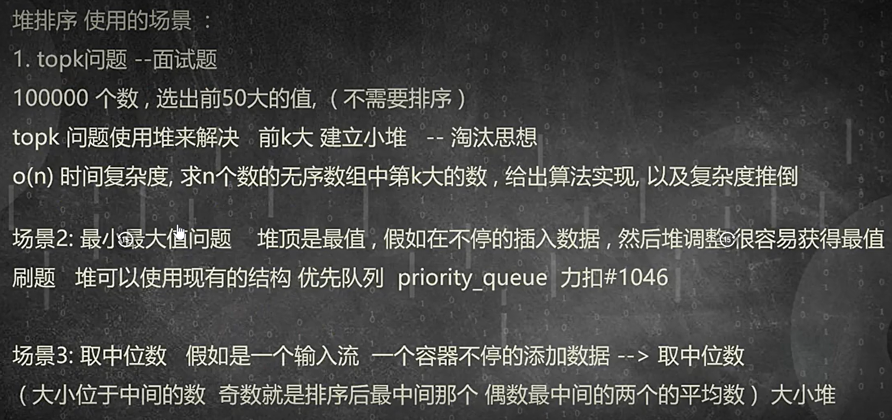

# 算法

#### 递归：将大的问题分解成相同的小问题，必须有一个明确的终点，解决小问题，按照原路返回就解决了大问题

- 主方法求解递归式
    - T(n) = aT(n/b) + f(n)
        - a：被分为几个问题。b：每个部分处理的数据为几分之n。f(n)：其他不相干的时间复杂度
        - n^log(a,b) 与 f(n)比较，谁大为谁，一样为n^log(a,b)*log(2,n)

#### 分治：一个大问题可以分解成若干个完全相同的小问题

- 问题难度随着数据规模的缩小而降低
- 问题可拆分
- 子问题的解是可以合并的
- 子问题是相互独立的

#### 二分

- 有变形，不一定一定为都都是递增和递减
- 循环
    - 时间：O(nlog(2,n)).空间：O(1)
- 递归
    - 时间：O(nlog(2,n)).空间：O(nlog(2,n))

#### 哈希表

- 思想：通过方法把元素分成每个n各组，理想情况下每个组只有一个元素，这样直接找组就能直接找到了，如果这个组没有就说明没有这个元素
- 处理冲突数据
    - 装载因子：α = 个数/表长
    - 开放地址法
        -  线性探测：有冲突就找个没人的地方放进去
            -  α < 0.8：扩容，需要建立一个新的数组，里面的元素需要移动，空间开销大，数据域越大开销越大
            - 优点：数据量小，单个数据占用空间占比小
        - 二次探测
    - 拉链法：有冲突直接发在下面
        - α  < 1 ，当达不到要求后，需要扩容，相比于线性探测空间消耗小，节点直接拿走移动就行，删除旧的数组就行
        - 优点：
            - 处理冲突简单
            - 空间占用少
            - 删除数据简单
            - 数据量大，单个数据占用空间比小，适用拉链法
- 
- 

#### 回溯

- 在广度上循环遍历，在深度上，递归选择
- 适用于集合，排列，组合，棋盘，迷宫
- 模板 void BackTracking（参数） { if(结束条件) 收集结果 return for（可能性） 	做选择 	BackTracking（） 	撤销选择 }
    - 标记array
    - 遍历
        - 打印顶点
        - 标记
        - 遍历邻接点
        - 找li邻接的且未被打印的

#### 排序

##### 冒泡排序

- 核心思想
    - 相邻两个元素比较，左边大，交换
- 优化
    - 数组可能原先就是有序的，或者最后一部分是有序的，如果有序（这部分在最后，并且对整个排序过程，这部分不会在动了）的也去遍历比较，这是没有意义的。我们下次排序只需要遍历到这部分之前就可以了
        - 因此index记录最后一次交换节点的下标，下一次比较的范围为0-index的范围
- 时间复杂度：
    - 最好的情况：有序：O(n)
    - 最坏的情况：O(n^2）
    - 平均复杂度：O(n^2）
- 空间复杂度
    - 原地交换：O（1），稳定的排序

##### 选择排序（SelectionSort）

- 找到其中最大的元素的数组下标，与最后的位置交换，缩小范围，再次查找

- 插入排序(insertSort):无交换
    - 将数组分为两部分：有序，无序
    - 无序部分第一个元素进入有序部分，与有序最后一个比较，有序大，向后移动，和下一个比较，无序大，放入
    - 过程
        - 保存无序元素
        - 倒序遍历有序array
            - 比较有序无序大小
                - 无<有，由移动一位，继续比较
                - 无>有 放入有序后一位，结束为此循环
    - 适用场景
        - 长度小于等于16
        - 每个元素距离最终位置很近
- 希尔排序(ShellSort)：缩小增量
    - 将数组分组，每个元素与下标+n/2的这些元素为一组，这一组内进行插入排序
    - 排序后，距离再次缩小，直到为一，此时适合插入排序，插入排序(其实距离为一就是继续希尔也就是插入)
- 计数排序(CountSort)：非比较
    - 数据出现密集，元素重复出现，最大最小值差距不大
    - 原型(最简单的原始的)
        - 找出数组中的最大最小值
        - 创建计数数组
        - 计数
        - 放回
    - 优化
        - min，max
        - 计数数组
        - 计数
        - 将计数数组改为名次（既改计数数组对应元素在排序后最后的位置）
        - 创建新的数组
        - 倒叙遍历原数组
            - 通过元素值找到名次，放入新数组，名次减1
        - 新数组覆盖原数组
        - 释放

##### 快速排序(QuickSort)

- 找一个标准值，将比其小的数据均放在其左侧，比标准值大的数据，均放在其右侧，两部分分别重复之前操作
- **挖坑填补发**：
    1. 找一个基准值：最前面或最后面
    2. 从基准值的对侧开始，假设基准值为最前面的值，从后开始遍历
    3. 找到比基准值小的移动到前面
    4. 然后从前面找比基准值打的移动到前面
    5. 重复3，4操作,直到先后两个指针相遇，将基准值写入
    6. 对基准值左右两侧再次分别重复上述操作，直到长度为1结束
- 时间复杂度：
    - 最好和平均：nlogn
    - 最坏：有序：O(n^2)
- 空间复杂度：O(log(2,n))
- 变形：幸运数可以被3整除，要求幸运数在前面
    - 左右找，左侧找非幸运数移到右侧，右侧找幸运数移到左侧

- **区间分割法**：
    1. 以最后一个元素为基准，使前s个元素都比基准值小
    2. 从头开始遍历，两个指针，分别为遍历寻找小于基准值的指针和小于基准值的边界
    3. 遍历，当元素值小于基准值时，交换到边界，边界移动，直到寻找的指针移动到末尾，将基准值移动到边界
    4. 左右两侧重复上述过程

##### 归并排序：(MergeSort)

- 将多个有序数组进行合并，合并为一个

##### 堆排序(HeapSort)

- 大顶堆
- 小顶堆
- 

##### 桶排序

- [0,1)区间内的小数，小数位数相同
- 将数据元素按照规则分组，各组之内排序

- 基数排序(RadikSort)
    - 思想：在高位相同的情况下，低位的顺序为数据的顺序
    - 分为：MSD，LSD，一般用LSD地位优先
    - 找到最大值，根据最大值确定有几位，然后最大值有几位就排序几次，根据低位的进行分组，分组按照尾插的方式，下次根据更高位排序，最后一次根据最高位的分出结果为顺序排序
    - 过程：
        - max
        - 拆位(判断max有多少位)
        - 按位处理
            - 表头
            - 拆位
            - 添加(尾)
            - 放回原数组，释放空间
            - 处理更高位

#### 动态规划(DynamicProgramming)

- 动态规划求最优解
- 通过子问题的最优解，可以得到当前问题的最优解
- 子问题的最优解也叫状态
- 子问题需要有无后效性(只关心结果)
    - 无后效性
        - 一旦某个状态北区欸的那个，那么过去这个状态是如何被求得的并不关心(过去不影响将来)
- 最优字结果性质
- 思想
    - 拆分
    - 定状态
    - 做决策
    - 状态转移方程
- 过程
    - dp[]//考虑i与dp[i]的关系
    - 初值
    - 遍历顺序
    - 状态转移方程
    - 输出
- leetcode上面的dp这类题
    - 打家劫舍
    - 股票买卖
    - 背包
    - 子序列
- 凑钱
    - 1，3，5组合最少个数和为n
    - i为和为几，dp[i]为最少需要的个数
    - dp[0] = 0; dp[1] = 1; dp[2] = dp[2 - 1] + 1 =2; dp[3] = min{ dp[3 - 3] + 1= 1;                dp[3-1] +  1 = 3;} = 1; dp[4] = min{dp[4 - 3] + 1 = 2;                     dp[4- 1] + 1= 2;} = 2; dp[5] = min{dp[5- 1] + 1= 3;                       dp[5 -3] + 1 = 3;                       dp[5- 5] + 1= 1;} = 1;
        - dp和穷举是有区别的，dp在讨论时前面放弃的后面不会出现，向dp[5] 的5个1，在这里就没有，因为在前面dp[3]有讨论都为1的情况，但是放弃了，所以dp[4] ,没有不需要管dp[3]怎么组成的，只需知道dp[3]的最好组成为2就可以了
- LIS最长递增子序列
    - 可以不连续，但是要求递增
    - 从开始0的位置向后计算LIS
    - v[j] <= v[i] &&0 <= j < i; dp[i] = max {dp[j] + 1,1}
    - 8，2，3，1，7，5，4，9，6
    - dp[0] = 1; dp[1] = 1; dp[2] = 3 > 2 d[1] + 1 = 2; dp[3] = 1; dp[4] = {                   1;         7 > 1 dp[3] + 1= 2;         7 > 3 = dp[2] + 1 = 3;         7 > 2 = dp[1] + 1= 2; } = 3; dp[5] = max{ 1;                 5 > 3 = dp[2] + 1 = 3;                 5  > 2 = dp[1] + 1 = 2;                 5 < 8; } = 3;
    - 优化：
        - 上面的方法在遍历前面的已经比较过了，包含在每一方面，每次全都遍历浪费时间，
        - 我们另创建一个数组，记录下下标长度的对应字符字串的最右侧边界的最小值(两个字符串长度一样记录最小的，这样直接和最小的比较，比小的还小，肯定比其他的小)
            - 0 ，1，2，3，4，5，6，7，8，8 8，2，3，1，7，5，4，9，6，0
        - 0 1 2 3 4 5 6 7 8 9 0  x  8
            - 没有长度为0的
                - 记录下标对应长的的字符串的最右侧的最小值
        - 0 1 2 3 4 5 6 7 8 9 0  x  2 3
            - 0 1 2 3 4 5 6 7 8 9 0  x  1 3 7
                - 0 1 2 3 4 5 6 7 8 9 0  x  1 3 5
                    - 0 1 2 3 4 5 6 7 8 9 0  x  1 3 4 9
                        - 0 1 2 3 4 5 6 7 8 9 0  x  1 3 4 6
                            - 0 1 2 3 4 5 6 7 8 9 0  x  0 3 4 6
        - dp 0 1 2 3 4 5 6 7 8 9      1 1 2 1 3 3 3 4 4 1
    - 进一步优化，对应长度比较时，可以选用二分的思想
- 捡苹果
    - A[m][n]的格子，中，每个有不一样的数量苹果，从[0][0]开始走，每次可以走下面或者右面，求最多捡苹果的路径
    - 最终走到最下方的右侧，我们用一个dp[m][n]存储在对应位置从[0][0] 开始所能捡的最多苹果，从好网前，d[i][j] = max{dp[i-1][j],dp[i][j-1]} + A[i][j];

# 思想

- 判断两个链表是否相交有重合：LCR 023. 相交链表
    - 两个链表为Y形状
        - 求出两个链表的长度，长的先走多出来的部分，然后同时出发，两者会在交点相遇
- 一个链表有环：LCR 022. 环形链表 II
    - 形状为6形状
        -  思路1
            - 通过快慢指针判断是否为环状
                - 一个指针移动满一个指针移动快，两者会相遇，则有环，无环会移动到NULL
            - 找到两者相遇的位置然后一个固定不移动，另一个跑一圈再次相遇，得出环长
            - 得出环长后，让其中一个指针回到原点，然后先走环长的步数，然后两个指针同速度移动，再次相遇时，相遇点为交点
        - 可以找到相遇点后，然后在相遇点分割，变为Y行，就变为解决Y行的问题了
        - 断开，指向新节点，如果已经指向新节点，则为循环链表的入口节点
        - 反转：第一遍得到长度，创建数组，再次反转并且记录节点地址，数组双指针前后遍历，地址不一样的前一个为入口节点

# 代码题

- 0116Q
    - 有n个元素，每个元素值的范围在0~n-1范围内，请检测数据是否重复出现，如果有，报错
- 0119
    - 一组元素，有一个元素仅出现一次，其他元素均出现偶数次，请迅速找出只出现一次的元素
        - 暴力：n^2
        - count:map/hash
            - 时间：
                - map：O(nlog(2,n))
                - hash：O(n)
            - 空间：O(n)
        - sort
            - 时间：O(nlog(2,n))
            - 空间：O(log(2,n))
        - ^
            - 时间：O(n)
            - 空间：O(1)
    - 一组元素，有两个个元素仅出现一次，其他元素均出现偶数次，请迅速找出只出现一次的元素
        - ^,找出不同位置，所有的数异或，得到的为两个单独出现的数的位置数不同的值，找到其中一个为一的数字，数组中的数与该数与，为零与不为零分成两组，两组中找出分别找出一个出现一次的数
    - 有n个元素，数值在1~n之间，数字之间无重复，突然少了一个数字，请找到这个数字
    - 有n个元素，数值在1~n之间，数字之间无重复，突然多了一个数字，请找到这个数字
- 0120
    - 用位运算实现加法运算
        - a,b异或得到不需要进位的位置
        - a,b与上，得到需要进位的位置，并左移
        - 上面得到的两个数，继续执行直到a,b与为零
- 0122
    - 有序查找
        - 循环
            - 时间：O(nlog(2,n)).空间：O(1)
        - 递归
            - 时间：O(nlog(2,n)).空间：O(nlog(2,n))
- 0123
    - 单链表:创建，插入，打印，长度，倒叙打印
- 0124
    - 判断两个链表是否相交有重合：LCR 023. 相交链表
        - 两个链表为Y形状
            - 求出两个链表的长度，长的先走多出来的部分，然后同时出发，两者会在交点相遇
    - 一个链表有环：LCR 022. 环形链表 II
        - 形状为6形状
            - 通过快慢指针判断是否为环状
                - 一个指针移动满一个指针移动快，两者会相遇，则有环，无环会移动到NULL
            - 找到两者相遇的位置然后一个固定不移动，另一个跑一圈再次相遇，得出环长
            - 得出环长后，两个指针指向头，然后一个先走环长的步数，然后同时走，相遇的位置为向交的点
- 0126
    - 单向链表只知道中间的一个指针，删除该指针指向的位置，要求不改变原结构
        - 我们可以把下一个节点的值放在该节点内，然后该节点指向下一个的下一个，然后删除下一个即可
    - 一个复杂链表，一个指针下一个正差指向下一个，但是另一个指针域（复杂指针）随机指向一个节点，要求复制这个链表
        - 我们分三步走：1.在原链表的每个节点后面插入一个节点
        - 2.让原先的节点的下一个节点(也就是新插入的节点)的复杂指针指向原先的节点的复杂指针的下一个
        - 3.将原先节点与后插入节点分离，两个指针指向第一第二节点，第一节点为原先链表的头节点，第二指针为插入节点头节点，然后改变next指向，改为下个节点的下个节点
- 0128
    - 中缀表达式转后缀表达式(逆波兰表达式)
        - 中缀转后缀
            - 1.借助辅助栈实现
            - 2.遇到数字或者字母打印
            - 3.遇到符号，与栈顶符号优先级进行比较
                - 栈内优先级高，出栈打印
                - 知道遇到优先级低的，进栈
                - 如果是“（”无条件入栈。如果是“）”栈顶出栈，直到“（”出栈
        - 后缀转中缀
            - 1.借助辅助栈实现
            - 2.遇到数字或者字母入栈
            - 3.遇到符号，将栈顶元素的下一个和栈顶元素构成表达式
- 0130
    - 栈的min
    - 滑动窗口
- 0131
    - 字符串修改
        - 有一个字符串，然后用一个字符串替换掉其中的某个字符，如lunck替换空格，空间足够大
            - 获取空格的个数，绕后找到最后一个字符移动多少位，找到最后位置，标记，同时标记元字符位置，两者同时移动，遇到空格后后面的标记移动替换字符长度，然后两者再次同步移动，知道两者相遇代表替换完成
            - 截断，拼接
            - 暴力
            - 新建数组
- 0201
    - 字符串循环右移
        - abcdefg变成efgabcd
            - 可以先整体倒置在局部导致
            - 右移n次，再把后面的提到前面
            - 栈
            - 截断
    - 数组循环右移
        - 与上面字符串一样
    - 有序数组循环右移然后查找最小值
        - 二分
            - 找到中间值，判断mid比右侧大怎mid在右侧，mid比右侧小在左侧，同时判断mid的左侧的值和右侧的值，左侧值大，则mid为最小值，右侧小则右侧为最小值
- 0220
    - 二叉树
        - 按层打印队列
            - 与下面的是一类问题，需要找到每一行最后的位置
                - 遍历队列+队尾标记+过往节点栈
                    - 队尾标记存储队尾，队列前面的与对尾标记元素相同，过往节点栈中的最后一个进栈元素为队尾元素
                - 队内标记：队列中根节点结尾加标记，遇到标记标记进入队尾
                - size（）：获取队列的长度，每次减一，到零换行，在获取长度
                - 双队列做分层：队列放其中一行，这行的左右孩子放另一个队列里，循环
                - 补齐为CBT
                    - 空位为NULL进队列，遇到NULL，队列进两个NULL，2的次幂换行，直到整个行全是NULL
                - 尾标记
                    - 一个节点存储行尾，遇到的的话队列最后一个为下一行行尾
                - 双标记（当前层/下一层）
                    - 一个标记当前行尾，另一个记录此时找到下一行最右边的元素，当找打印到当前行队尾时，另一个记录的就是下一行队尾
                - 双计数器
                    - 两个存储标记，一个记录当前行有几个，另一个记录下一行的个数，当前行为0时，换行
                - 双队列层数计数
                    - 一个队列为遍历队列，另一个队列为遍历队列元素对应的行数，当行数不一致时换行
                - 二维数组
                    - 根节点放第一行，孩子节点放在下一行
        - 右视图（左）
        - 高度/层数
        - Z字形：先从左开始打印，下一行从右打印，这行下一行左打印
        - 求每层平均值

# leetcode

- 数组
    - 二分
        - 有序的数组，无重复的元素，注意边界问题
        - 防止溢出：mid = left + ((right - left)/2);
        - 题
            - \704. 二分查找
            - 变形
                - 35.搜索插入位置
                    - 目标值在数组所有元素之前 此时right = -1，left = 0； return left
                    - 目标值等于数组中某一个元素 return n;
                    - 目标值插入数组中的位置 此时left > right,left左侧为right，right和它左侧小于target，left和left右侧大于target
                    - 目标值在数组所有元素之后的情况，left = size，right = size -1;
                - 34.在排序数组中查找元素的第一个和最后一个位置
                    - 找到这个元素，然后左右找边界
                - 69.x 的平方根
                    - 用二分算平方根是否相等，不等按照二分移动
                - 367.有效的完全平方数
                    - 还是二分相等返回true，退出while返回false
    - 双指针
        - 双指针法（快慢指针法）： 通过一个快指针和慢指针在一个for循环下完成两个for循环的工作。
        - 定义快慢指针
            - 快指针：寻找新数组的元素 ，新数组就是不含有目标元素的数组
            - 慢指针：指向更新 新数组下标的位置
        - 题
            - \27. 移除元素
                - 是目标值慢指针不动，不是快指针的值覆盖慢指针的值
            - 26.删除排序数组中的重复项
                - //思路：快慢指针，重复出现，快指针移动，慢指针不动，不是重复，快指针覆盖慢指针位置
            - 283.移动零
                - //思路：将所有非零元素覆盖，满指针后面的都为零
            - 844.比较含退格的字符串
                - //思想：双指针，从后往前遍历,这么写优点难判断边界问题，情况很多，不建议    //"nzp#o#g""b#nzp#o#g"这两个很难解决，
                - //思想：双指针，从前开始遍历，#慢指针后退一步
                - //思想：栈
            - 977.有序数组的平方
                - //思路：前后双指针，比较平方根大的移动
    - 滑动窗口
        - 滑动窗口，就是不断的调节子序列的起始位置和终止位置，从而得出我们要想的结果
        - 实现滑动窗口，主要确定如下三点：
            - 窗口内是什么？
            - 如何移动窗口的起始位置？
            - 如何移动窗口的结束位置？
        - 滑动窗口的精妙之处在于根据当前子序列和大小的情况，不断调节子序列的起始位置。从而将O(n^2)暴力解法降为O(n)。
        - 题
            - \209. 长度最小的子数组
                - 先找到从起始位置开始直到和大于目标值的位置
                - 记录窗口大小，移动起始位置
                - 判断和大于目标值么，大于重复上述过程，直到数组遍历完成
            - \904. 水果成篮 - 力扣（LeetCode）
                - 
            - \76. 最小覆盖子串 - 力扣（LeetCode）
                - 
    - 模拟行为
        - \59. 螺旋矩阵 II - 力扣（LeetCode）
        - \54. 螺旋矩阵 - 力扣（LeetCode）
        - LCR 146. 螺旋遍历二维数组 - 力扣（LeetCode）
- 链表
    - \203. 移除链表元素 - 力扣（LeetCode）
        - 考虑为空，和删除的目标是否是头节点
    - \707. 设计链表 - 力扣（LeetCode）
        - 增删改查
    - \206. 反转链表 - 力扣（LeetCode）
        - 两个指针一个指向null，一个指向head
        - 可以用虚拟头节点
    - \24. 两两交换链表中的节点 - 力扣（LeetCode）
        - 虚拟头节点好写一点
        - 需要先处理前两个，剩下的统一处理
    - \19. 删除链表的倒数第 N 个结点 - 力扣（LeetCode）
        - 利用双指针，让快指针先走，
    - 
- 刷题是遇到的不会的知识点
    - 字符串截断
        -  s.replace(slow,s.size() - slow,"");//从第一个参数的位置，第二个参数的长度替换为后面的
    - STL
    - map判断key的存在
        - if (mymap.count(key) == 0)    cout << "no this key" << endl;