[TOC]

# 动态静态库(链接方式不同)

linux里面是：共享库和静态库

- 未定义标识符
    - 编译器不认识这个函数，解决办法：加头文件
- 无法解析的外部符号
    - 编译器找不到函数的实现，解决办法：添加依赖库
        - \#pragma comment(lib , "...........lib")

动静态库的优点是：封装起来，不让其他人看到代码实现

- 静态库
    - 原理
        - 静态库在链接期，把库文件拷贝到可执行文件中
    - 使用方法
        - 把头文件拷贝到当前项目中，在文件中包含（include）
        - 把库文件拷贝到当前项目中，在文件中添加依赖（#pragma comment() ）
    - 优点
        - 调用速度相对较快
    - 缺点
        - 浪费内存空间（多个应用程序依赖于同一个静态库的时候，多个程序运行时，会在内存中拷贝多份静态库）,exe比较大
        - 对程序的跟新，部署，发布比较麻烦，静态库修改后，需要重新编译整个可执行文件，重新安装
- 动态库
    - 原理
        - 动态库在链接期，只把索引文件拷贝到可执行文件中，在运行的时候才能调用动态库
    - 使用方法
        - 把头文件拷贝到当前项目中，在文件中包含
        - 把索引文件拷贝到当前项目中，在文件中添加依赖
        - 把动态库dll拷贝到exe同文件夹内
    - 优点
        - 节省内存空间，（多个应用程序依赖同一个动态库时，多个程序运行时，会在内存中拷贝一份动态库），exe较小
        - 更新简单，动态库修改以后，只需要重新编译动态库即可
    - 缺点
        - 调用比静态库慢，移值的时候需要同时移值可执行文件和动态库

# 网络基础知识

### 网络基本模型

#### ISO/OSI七层网络模型

##### 应用层：提供应用程序间通信

- HTTP(80)
    -  未加密的，明文的，因此使用HTTP传输隐私信息是不安全的
- HTTPS(443)
    - 使由SSL+HTTP协议构建的可进行加密传输，身份认证的网络协议，比http安全
- FTP(21)
    - 文件传输协议，包括FTP客户端和FTP服务端
        - 服务端存储文件
        - 客户端通过FTP协议访问位于FTP服务器上的资源
    - 开发网站时，利用FTP协议把网页或者程序传到Web服务器上。此外，FTP传输效率非常高，在网络上传输大文件的时候，一般也采用该协议，想要访问FTP服务器，必须要有FTP服务器授权的账号，也就是用户名和密码
- DNS(53)
- DHCP(68)
    - 获取IP地址的服务
- Telnet(23)
- Smtp(25)
- SSH(22)

##### 表示层：提供数据格式转换服务

- 数据加解密，数据解压缩，图片/视频编解码

##### 会话层：建立，维护，管理会话

- session会话管理，服务器验证用户登录，断电续传

##### 传输层：提供应用进程之间的逻辑通信

- TCP
    - 传输控制协议，提供一种面向连接的，可靠的，基于字节流的传输层通信协议，有流量控制和差错控制。
    - 使用TCP协议的应用：邮件的接受和发送，文件传输，远程登陆。需要数据稳定和完整性比较高的场景使用多使用TCP协议
- UDP
    - 用户数据报协议，提供一种无连接的，高效的，低可靠的数据传输服务
    - 应用
        - 音视频聊天，在线游戏（王者），工业物联网数据传输。需要数据时效性较高的场景多使用UDP协议
- socket
    - 套接字是通信的基石，是支持TCP/IP协议的网络通信的基础操作单元
    - 进行网络通信必须的五种信息：连接使用的协议，本地主机的IP，本地进程的协议端口，远地主机的IP，远地进程的协议端口
- 进程
- 端口
    - netstat -ano:可以查看当前设备上进程使用端口的情况
    - 端口范围0~65535
        - 知名端口0 ~ 1023，不建议使用
        - 动态端口 1024 ~ 5000
        - 预留端口号 5000 ~ 65535
    - tasklist | findstr "3888"
        - 可以查看哪个进程占用了这个端口

##### 网络层：寻址和路由选择，分组转发数据

- 多层交换机，防火墙，ARP，RARP
- IP
    - 是整个TCP/IP协议族的核心，也是构成互联网的基础。
    - 连上互联网的每台主机的每一个接口都有一个IP地址，是一个32位二进制数，也可以用十进制表示
    - 网络上每台主机的IP都需要是唯一的不能重复
    - ipconfig查看当前电脑ip
- 路由器
    - 路由器时基于IP设计的，又称三层网络设备。路由器的端口具有MAC地址，因此他就能成为以太网的发送方和接受方；同时还具有IP地址

##### 数据链路层：提供链路管理（数据分帧，物理地址寻址mac，重发等）

- 网卡
    - 一块被设计用来允许计算机在计算机网络上进行通讯的计算机硬件，MAC地址用于在网路中唯一标识一个网卡，一台设备若有一个或者多个网卡，则每个网卡都需要并会有一个唯一的MAC地址。mac地址在生产时就已经定死。
- 二层交换机
    - 交换机，Switch，一种用于电（光）信号转发的的网络设备。
    - 交换机内部的CPU会在每个端口成功连接时，通过将MAC地址和端口对应，形成一张MAC表.今后的通讯中，发往该MAC的地址的数据包将仅送往其对应的端口，而不是所有端口
    - 当ＭＡＣ地址表找不到指定的ＭＡＣ地址会怎么样？
        - 交换机无法判断把该包转发到哪个端口，只能将包转发到除了源端之外的所有端口，无论该设备连接在哪个端口上都能收到这个包
        - 只用相应的接收者才接受包其他设备则会忽略这个包
        - 发送了包之后目标设备作出响应，只要返回了相应包，交换机就可以将他写入MAC地址表，下次也就不需要把包发到所有端口了
    - 路由器和二层交换机和三层交换机之间的关系
        - 二层交换机就是平常我们说的交换机，三层交换机就是具有全部二层交换机的功能和部分路由器的功能的设备
        - 交换机是只具有交换功能的设备，路由器具有交换功能和路由功能的设备。路由功能是指选择最佳路径。选择走距离最短的路径还是用时最少的路径就是路由器的工作，因为网络中的路况是实时变化的，前后发送的数据帧可能做不同的路线到达目的地

##### 物理层：提供比特流传输

- 网线，光缆
    - 在物理层将数字信号转换为电信号或者光信号

### C/S模型

- 客户端/服务器结构，一般要求的特定的客户端。每个应用程序有自己的客户端，互相之间不能互通。客户端和服务器之间可以使用任意协议通信，常用TCP/UDP协议

### B/S模型

- 浏览器/服务器模型。一般不需要特定的客户端。而是需要有统一规范的客户端。浏览器和服务器之间使用HTTP/HTTPS协议通信

### 单播，组播，广播

- 单播
    - 是指封包在计算机网络的传输中，目的地址为单一目标的一种传输方式。他是现今网络应用最为广泛的，通常所使用的网络协议或服务大多采用单播传输，例如基于TCP的协议
- 组播
    - 也叫多播，多点广播或群播。只把消息同时传递给一组目的地址。它使用策略是最高效的，因为消息在每条网络链路上只需要传递一次，而且只有在链路分叉的时候，消息才会被复制。组播类似于微信的群功能，利用交换机或者路由器，只有在这个群组内的设备才能收到消息
- 广播
    - 是指封包在计算机网络中传输时，目的地址为网络中所有设备的一种传输方式。实际上，这里所说的所有设备也是限定在一定范围之中的，称位“广播域”

### ARP协议

- 地址解析协议，是根据IP地址获取物理地址的一个TCP/IP协议。

     ARP报文格式：

- | 硬件类型 | 上层协议类型       | MAC地址长度 | 上层协议类型的长度 | 操作类型                   | 源MAC | 源IP  | 目的MAC | 目的IP |
    | -------- | ------------------ | ----------- | ------------------ | -------------------------- | ----- | ----- | ------- | ------ |
    | 2字节    | 2字节              | 1字节       | 1字节              | 2字节                      | 6字节 | 4字节 | 6字节   | 4字节  |
    | 1以太网  | 0x0800<br />IP协议 |             |                    | 1：ARP请求<br />2：ARP响应 |       |       |         |        |

    ARP包头：硬件类型到操作类型

- 怎么通过ARP协议获取mac地址
    - P1发送一个ARP请求，ARP报文里面只填了源mac地址和源ip地址，目的ip地址，目的mac地址不知道不知道填0.然后通过广播功能将ARP请求包以广播形式发送出去，交换机或WIFI设备收到广播包时，会将数据发给同一局域网的其他所有主机。其他主机收到发现不是自己的IP则丢弃，是的话，返回一个ARP响应包
    - 响应包，把自己的ip，mac和目的ip和mac都填入然后发送出去，P1收到回复报文时，就知道了想知道IP的mac地址了
    
- ARP代理
    -  路由器是分割广播域的，如果我们要查询的IP地址在外网，此时ARP广播请求时，本地网络不会有主机回应，此时路由器会回应请求，则发送源误认为路由器就是目的主机，会将报文全部转发给它，再有路由器转发报文到外网，则该路由器就被称为ARP代理
    
- 免费ARP
    - 在主机开机时，会发送一个目的IP地址为自己的IP地址的ARP请求报文，该报文称为免费ARP
    - 作用
        - 让主机确认本地网络是否有与自己IP地址相同的主机，若有则会返回一个错误报文
        - 若接收主机ARP缓存中本身就有发送源主机的IP--MAC对，怎会更新，否则，会缓存发送源的IP--MAC对


### DNS协议

- 域名解析协议，DNS服务器将好记的域名解析成IP地址。
- nslookup可以查看域名对应的ip地址
- 获取ip地址流程
    - 客户端先到DNS服务器询问域名的ip地址，如果本地DNS缓存里面有这个域名的话，直接告诉客户端ip地址是多少；如果没有话就先去DNS根服务器去询问域名的ip地址。此时根服务器会告诉本地服务器下一级查询的DNS服务器地址，本地服务器询问该服务器，返回下一级地址，重复上述，直到查询到，然后将该域名和它对应的ip写入自己的缓存中，方便下次客户端访问时直接告诉客户端
- gethostbyname：可以实现DNS
    - 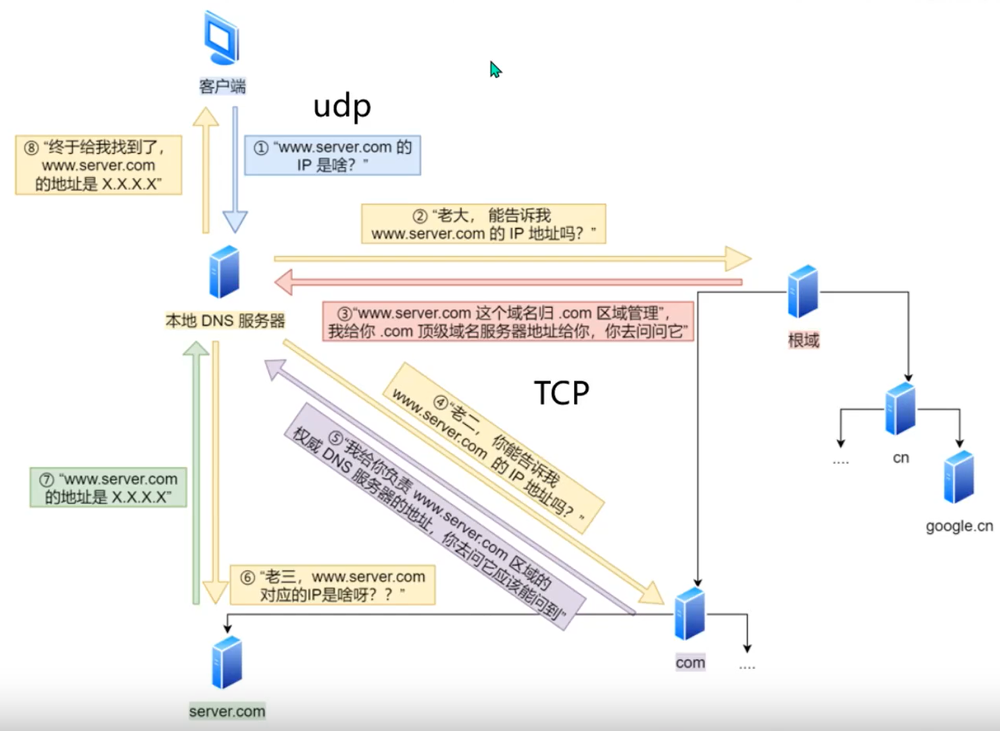	


### TCP/IP协议格式

#### 子网划分

- ip地址分类
  
    - | 类型 | 范围                                   | 作用                     |
        | ---- | -------------------------------------- | ------------------------ |
        | A类  | 1.0.0.0~127.255.255.255（0001 0000）   | 大量主机，公网           |
        | B类  | 128.0.0.0~191.255.255.255（1000 0000） | 国际大公司，政府         |
        | C类  | 192.0.0.0~223.255.255.255（1100 0000） | 小公司，校园网，科研单位 |
        | D类  | 224.0.0.0~239.255.255.255（1110 0000） | 组播                     |
        | E类  | 240.0.0.0~255.255.255.255（1111 0000） | 保留                     |
    
- 私网
  
    | A类  | 0.0.0.0~0.255.255.255保留127.0.0.0~127.255.255.255系统回环测试（localhost 127.0.0.1）10.0.0.0~10.255.255.255政府预留 |
    | ---- | ------------------------------------------------------------ |
    | B类  | 172.16.0.0~172.31.255.255                                    |
    | C类  | 192.168.0.0~192.168.255.255                                  |
    
    

##### 子网掩码

- 又叫网络掩码，地址掩码，子网络遮罩，用来将某个ip地址划分为网络地址和主机地址。子网掩码是一个32位的2进制数，其对应网络地址的所有位置为1，对应于主机地址的所有位置都为0
    - 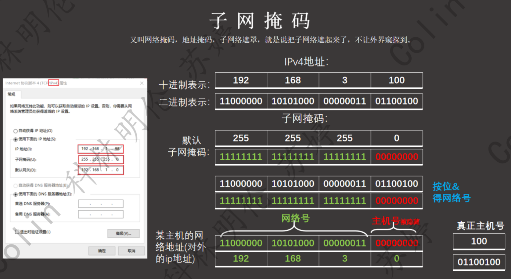	
        - 	

##### 网关

- 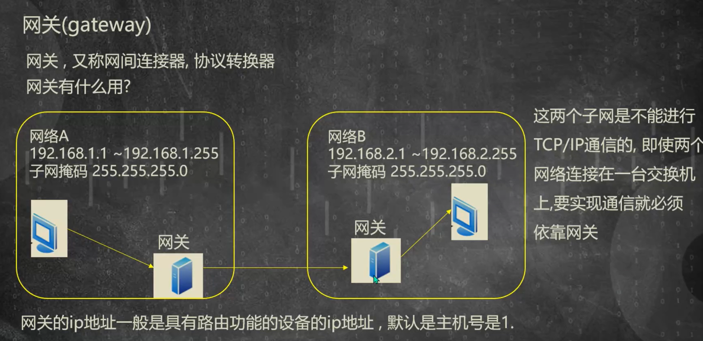	
- 网络A向网络B发送数据
    - A先发给网关A，网关A转给网关B，网关B再转给网络B

##### 广播

- 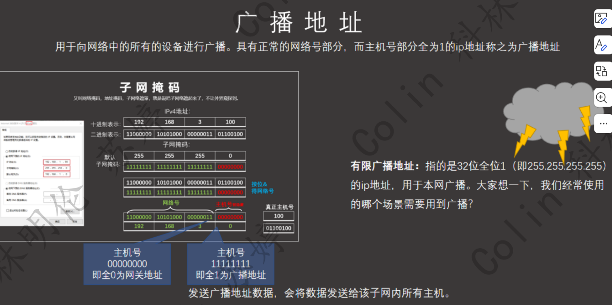	

##### 子网划分

- IP地址组成
    - 网络号+子网号+主机号
        - 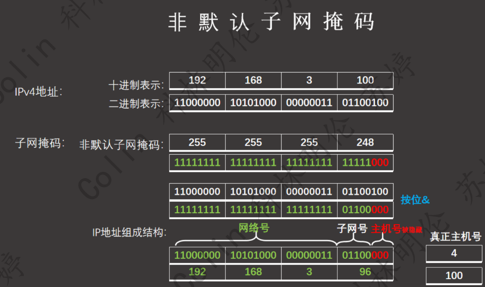	

##### 子网划分常见问题

- 选定的子网掩码将创建多少个子网
    - 2^x个。x为借用的主机位数。
        - 如：192.168.10.32/28。借用了4个主机位来重打网络位。
- 每个子网可以包含多少位主机
    - 2^y - 2个。y为媒介用的主机位位数，-2是因为，主机位全为0的部分是这个子网的网关，全为1的部分是这个子网的广播地址
- 有哪些子网
    - 算出子网的步长
        - 比如256-240 = 16，那么子网为 192.168.10.0 - 192.168.10.15 192.168.10.16-192.168.10.31 192.168.10.32-192.168.10.47 ..........
- 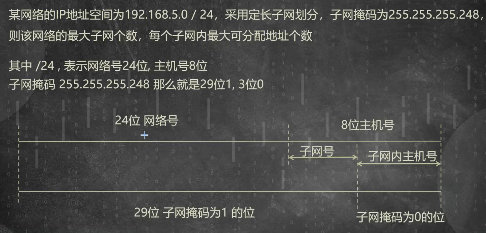
- 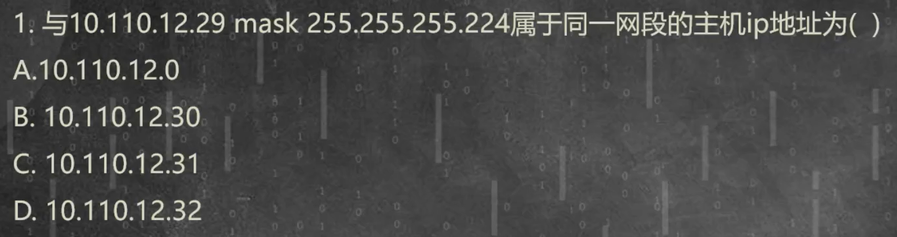
- B:5位主机号，0-31，0为网络号，31为广播地址，32不在同一个网段

### 以太网帧结构

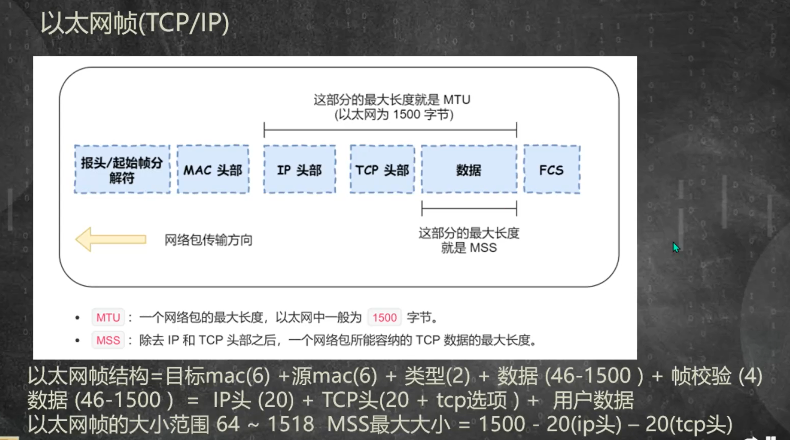

- MTU
    - 一个网络包的最大长度，以太网中一般为1500字节
- MSS
    - 出去IP和TCP头部之后，一个网络包所能容纳的TCP数据的最大长度。1460

### ip协议格式

- 	
- ip报文是在网络层传输的数据单元，也叫ip数据报。上述图每一行32位，4个字节，协议标准都是遵循对齐原则的
- 版本：4位，ip协议的版本，目前ip的协议版本号为4，（ipv4），下一代ip协议版本号为6
- 首部长度：4位
    - 最大数值15个单位（一个单位4字节），ip首部长度最大值为60字节
- 区分服务：8位，用来获取更好的服务，一般不使用
- 总长度：16位
    - 指首部和数据之和的长度，单位为字节，因此数据包的最大长度为65535字节。总长度必须不超过最大传送单元MTU
- 标识：16位 
    - 计数器，用来产生数据包的标识。通常每发送一个报文，它的值加1。当ip报文长度超过传输网络的MTU时必须分片，这个标识字段的值被复制到所有的数据分片的标识字段中，使得这些分片在达到最终目的地时可以依照标识字段的内容重新组成原先的数据
- 标志：3位
    - 两位有意义
        - MF
            - 最低位
            - 1，后面还有分片。 0，最后一个分片
        - DF
            - 中间位
            - 0，才允许分片
- 偏移位：12位
    - 指较长的分组在分片后某片在原先分组中的相对位置。以8个字节位偏移单位。比如说较长的一段数据共3800字节，分三段，每段1400字节，单么第二段数据片偏移就是1400/8 = 175，点三段时350。
- 生存时间：8位记为TTL
    - ip报文所允许通过的路由器的最大数量。每经过一个路由器，TTL减1，当为0时，路由器将该数据报丢弃
- 协议：8位
    - 指出IP报文携带的数据使用的是哪种协议，以便目的主机的IP层能知道要将数据报上交到哪个进程(不同的协议有专门不同的进程处理)。和端口号类似，此处采用协议号，TCP的协议号为6， UDP的协议号为17，ICMP的协议号为1，IGMP的协议号为2。
- 首部校验和：16位
    - CRC进行校验，鉴别头部是否损坏。计算IP头部的校验和，检查IP报头的完整性。
- 源ip地址：4字节
    - 标识IP数据报的源端设备。
- 目的ip地址：4字节
    - 标识IP数据报的目的地址，
- 可选字段：最多40字节
- ip头大小，最少20字节，可选字段最大40字节，所以ip头范围20~60字节

### tcp协议格式

- 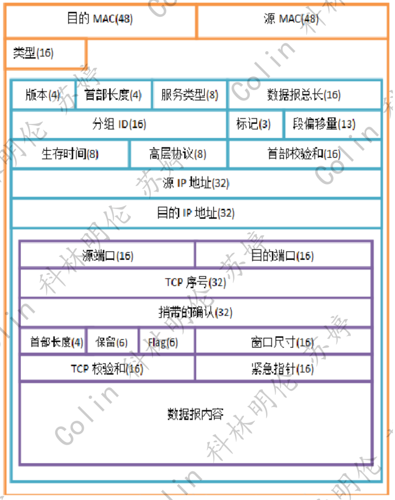	
- 上述图每一行32位，4个字节，协议标准都是遵循对齐原则的
- 源端口号：16位，数据报来源主机的端口号
- 目的端口号：16位，数据报目的主机的端口号
- tcp序号（seq）：占4字节32位
    - 是用来保证数据有序到达的关键，因为数据在网络中传输，有的数据包是先发送的但是后到到了，有的数据包是后发出的但是先到达了，就需要这个序列号来确保数据能够按照发出的顺序排列。
    - 数据是按照字节排序的，序列号是这个数据包起始的字节位置。比如我发送第一个包中的是seq = 0 ，数据报内容20字节，那么下一个数据报的seq就应该是21
    - 三次握手中第一次发送的序列号是随机的。在三次握手中要交换这个随机值，确认随机值是从什么时候开始的，这样可以建立连接。然后有序可靠传输
- 捎带的确认（ack）（确认序号）：4字节32位
    - 用来保证数据可靠到达的关键
    - 确认收到上一个数据报，然后ack的值是指定自己想要收到的下一个数据报的seq，比如我收到一个数据报的seq = 0，数据报内容20字节，那么我的ack就应该是21，用来标明我sq = 0，内容为20；字节的数据报已经收到了，我接下来的期望收到的是sq = 21的数据报
    - 假如说seq这个数据包丢了，或者ack这个包丢失了，那么发送端有个定时器，在一定时间内没有收到ack的包，就重新发送seq这个包，直到收到ack的包位置再进行下一个包的发送。
- 序号和确认序号保证了数据有序可靠到达
- 首部长度：4位
    - 和ip头部的长度域类似，这个域用来标明TCP头部的长度，单位也是字节，也可以说是数据报内容是从哪里开始的
- 保留：6位
    - 未使用的域
- Flag：6位：这6位分别代表了TCP包是个什么样的包
    - URG：紧急标志位
        - 1，代表紧急指针生效，说明次包中有紧急需要看的数据，紧急指针指向数据地址
    - ACK：确认序号标志位
        - 1，代表当前的包是确认包，确认序号生效
    - PSH：push标志位
        - 1，代表了当前包中的数据需要应用层尽快处理，不需要等到接收缓冲区填满后，尽快就将数据传递给应用层
    - RST：reset标志位
        - 重置连接，当连接的两端发生了一些异常的错误导致两端没有连接关系了，需要发送RST为1的包，通知对端需要重新建立连接
    - SYN
        - 表示包是用来建立连接使用的，说明包是三次握手的信息
    - FIN：断开连接标志位
        - 是TCP四次挥手里面的标志位
- 窗口大小
    - 指定了从未被确认的字节字节算起可以发送多少个字节
        - 用来做流量控制
- 校验和：16位
    - 校验范围包括TCP头、数据报内容和概念性伪头部。概念性伪头部又包括源!P，目的IP，TCP协议号。
- 紧急指针：16位
    - 指向数据报中紧急数据最后一个字节的下一个字节

### UDP协议格式

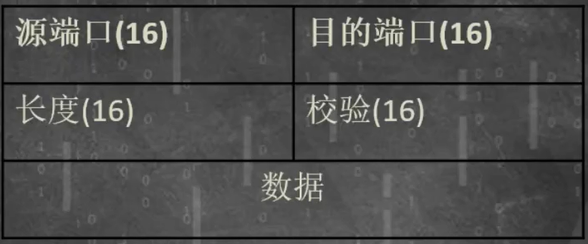	


### 与UDP相比

- TCP协议除了源端口和目的端口外，还增加了很多其他标志和校验位等，依靠这个位可以保证TCP传输的准确性。学习详细的TCP协议格式，还有助于我们在UDP协议的基础上进行扩展。例如，QQ就试使用UDP协议进行通信的，那基于UDP传输不可靠的特性，腾讯肯定是在UDP的基础上，应用层做了很多扩展来保证数据不会丢失

### TCP机制

#### ACK机制

- 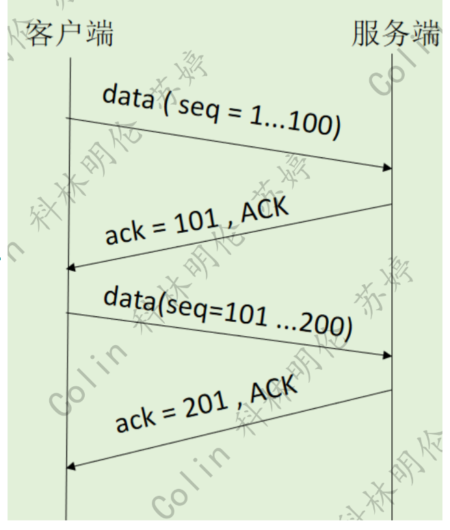	
- 也叫ACK应答机制。客户端发送一个数据，序列是从1开始的，一个数据包是100字节。服务端收到数据后，会回复一个已经收到的数据包，。这个数据包ACK标志位置1，然后ack=101代表下一次发送的数据是从101开始。然后客户端从101发送数据，100字节，下一个确认包中ack = 201

#### 超时重传

- 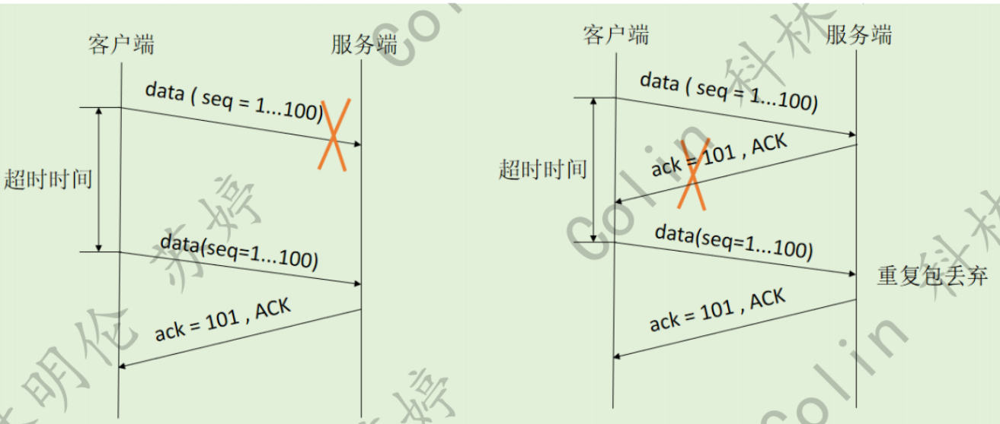	
- TCP是面向连接的，可靠的传输机制。如果包丢了，就需要重新传输。
    - 客户端个服务器发送一个数据报，序列号是1，大小是100字节。客户端会开启一个定时器，发送数据以后开始计时，如果计时结束也没有收到服务器回复的确认包，那就重新发送一遍刚才的数据
    - 这里没有收到回复确认包有两种情况：
        - 发送的数据包丢失
        - 服务端回复的确认包丢失了，那么客户端到超时了以后还会再发送一遍刚才的数据，这时服务端收到这个数据发现是刚才已经处理过的数据，就会丢弃不处理这个包，但是仍然会回复确认包给客户端

#### 三次握手

- 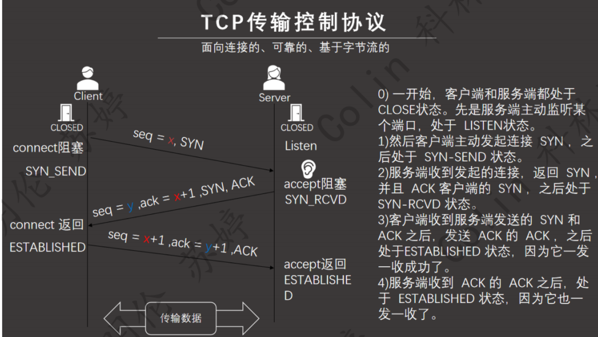	
- 三次握手是用来建立连接的流程
- 流程
    - 首先客户端和服务端都处于CLOSED状态。先是服务端主动监听某个端口，处于LISTEN状态。
    - 客户端使用connect主动发起连接服务端，connect是阻塞式连接，SYN标志位为1，因为之前没有通信，这个时候序列号seq是随机的数x，之后客户端处于SYN_SEND状态
    - 服务端收到发起的连接，应答收到的SYN同时建立连接（就是回复一个包既做应答又做建立连接）。应答为ACK标志位为1，ack = x + 1，建立连接是SYN标志位为1，seq也是一个随机数y。accept也是阻塞的，之后服务端处于SYN_RCVD状态
    - 客户端收到服务端发送的SYN和ACK之后，再发送一个ACK，此时seq = x + 1，ack = y + 1，ACK标志位为1.之后客户端处于ESTABLISHED（已确立的）状态，它一发一收成功了，connect返回了
    - 服务端收到ACK之后，处于EDTABLISHED状态，它一发一收也成功了，accept返回了
- 为什么是三次握手？不是两次也不是四次？
    - 因为TCP为了实现可靠传输，发送方和接收方需要同步序号。序号并不是从0开始的而是由双方随机选择的初始序列号，TCP是双向通信的，双方都要确认都有能力发送信息，并接受响应。因此，通信双方都要随机产生一个初始序列号，并且把这个序列号告诉对方，得到确认回复的ack，因此不能是两次的
    - 我们把中间的SYN和ACK合在一起了，分开的话浪费资源和空间

#### 四次挥手

- 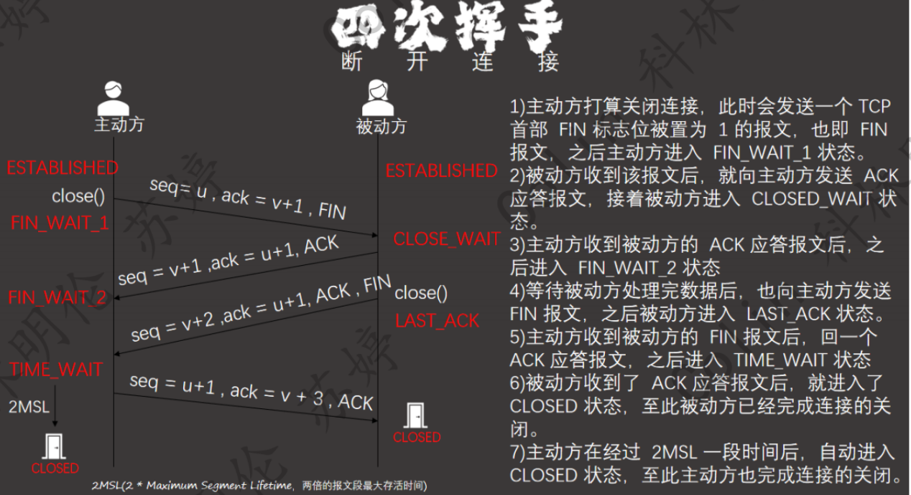	
- 流程
    - 主动方打算关闭连接，调用close()函数后，会发送一个TCP首部FIN标志位为1的报文，FIN报文，之后主动进入FIN_WAIT_1状态。数据包中的seq = x，ack = y + 1都是承接之前数据传输下来的，FIN位置为1
    - 被动方接收到该报文后，就向主动方发送ACK应答报文，接着被动方进入CLOSE_WAIT状态。应答报文中seq = y + 1，ack = x + 1，ACK 位置为1。此时被动方不能立刻断开连接，因为可能还有一些数据在路上，还有一些收到的数据没有处理完，需要处理一段时间
    - 主动方收到被动方的ACK应答报文后进入FIN_WAIT_2状态
    - 等待被动方处理完数据后，也像主动方发送FIN报文，之后进入LAST_ACK状态。报文中seq = y + 2，ack = x + 1，ACK标志位为1，FIN标志位为1
    - 主动方接收到被动方的FIN报文之后，回一个ACK应答报文，之后进入TIME_WAIT状态。报文中seq =  x + 1，ack = y + 3，ACK标志位为1
    - 被动发收到了ACK应答报文之后，就进入到CLOSED状态，至此被动方已经完成连接的关闭
    - 主动方在经过２倍的MSL一段时间后，自动进入到CLOSED状态，至此被动方已经完成连接关闭
        - 因为主动方最后发给被动方的ACK报文不知道能不能收到，如果一段时间后没有收到被动方重新发送的第三个数据报FIN数据报的话，就是说被动方已经收到主动方发送的ACK了。然后主动方进入CLOSED状态
- 为什么是四次挥手
    - 因为被动方不知道主动方是什么时候要断开连接,所以主动方在断开连接的时候,被动方可能会有一些数据还在路上，主动方法送断开连接只代表主动方不在给被动方发送数据了，不代表之前的数据都已经到达了，而且被动方可能还有一些数据没有剖处理完，需要一段时间。所以主动方往发送方发送的FIN断开连接请求不能跟ACK数据报一起发送，需要等待一段时间以后单独发送一个断开连接的数据报。所以需要4次才能断开连接
- 为什么TIME_WAIT状态等待2MSL
    - MSL是报文最大生存时间，它是任何报文在网络上存在的最长时间，超过这个时间报文将被丢弃。2SML这段时间保证数据包可以一去一回 ，防止四次挥手的第四次数据包丢包后，无法重传数据包，导致服务器无法正常关闭。假如第四个包丢了那么1个MSL事件后，服务器会给可会向客户端重传一个FIN包，2倍的MSL时间正好够收到服务器重传的FIN包的时间。所以等待两倍的MSL时间
    - 因为没有办法确认最后一个包对端能不能收到，所以只能使用超过一段时间后自动关闭的方式来断开连接


### TCP/IP协议相关知识

#### RTT：往返时延

- 在计算机网络中它是一个重要的性能指标，表示从发送端发送数据开始，到发送端收到来自接收端的确认（接收端收到数据后立即确认），总共接收到的时延
- 三个决定部分
    - 链路的传播时间，末端系统的处理时间，路由器的缓存中的排队和处理时间
        - 其中前两部分的值作为一个TCP连接相对固定
        - 路由器的缓存中的排队和处理时间会随着整个网络拥塞程度的变化而变化
            - 所以在一定程度上，RTT的变化反映了网路拥塞程度的变化

#### RTO：超时重传时间

- TCP每发送一个报文段，就对次报文段设置一个超时重传计时器。此次计时器设置的超时重传时间RTO应当略大于TCP报文段的平均往返时延RTT，一般RTO= 2RTT。但是，也可以根据具体情况认为调整RTO的值。当超过重传时间还未收到对此TCP报文短的预期确认信息，则必须重新传输此TCP报文段

#### 滑动窗口

窗口概念:TCP 是每发送一个数据，都了，再发送下一个。这个模式就有点像我和你面对面聊天，你一句我一句。但这种方式的缺点是效率比较低的。

- 窗口大小
    - 指无需等待确认应答，而可以继续发送数据的最大数值。
        - 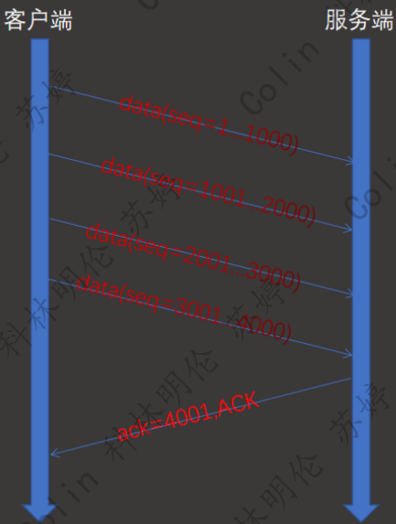	
    - 发送端一口气发送4个包，接收端四个都收到后，一起回复一个确认包ack = 4001，说明1到4000已经收到了。这叫累加应答或者累积应答
    - 窗口大小的决定
        - 在三次握手的时候，在发送的第二帧握手信息的时候回复ack里面会带窗口的大小，会交换窗口大小
        - 通常是由接收方的窗口大小决定的
        - 发送方的数据大小不能超过接收方的窗口大小，否则接收方就无法正常接收到数据
            - 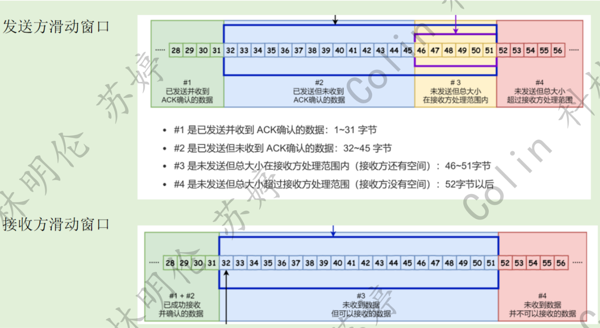	
- 滑动窗口可以理解为缓冲区的一部分，蓝色的框是滑动窗口，双方都有一个滑动窗口
    - 发送方缓冲区部分
        - 已发送并且得到ACK确认的数据
        - 已发送，但是未收到ACK确认的数据
        - 未发送但是在滑动窗口大小范围内（接收方处理范围内）
            - 接收窗口比实际要发送的数据大时，可能会发送该情况
        - 未发送，但是不在接收方处理范围之内的
    - 接收方缓冲区部分
        - 已成功接收并且确认的区域、
        - 未接受到数据但是可以接受的数据
        - 未接受到数据，并且不可以接收的数据
- 假如滑动窗口大小20字节，发送方发送32-45字节的数据，接收方只接受到32-38字节的数据，此时接收方的滑动窗口向后移动到39数据的位置，因为39数据丢失了，那么接收方发送给发送方的回复ack=39，然后发送方的滑动窗口也移动到39的位置，然后发送方下次发送的数据从39开始发送

#### 流量控制

- 流量控制是通过滑动窗口来实现的。在实际的传输中，滑动窗口的大小是不断变化的，其变化和流量控制有关
- 所谓流量控制，主要是接收方传递信息给发送方，使其不要发送数据太快，是一种端到端的控制。
    - 主要方式是返回的ACK中会包含自己的接收窗口的大小，并且利用大小来控制发送发的数据发送
- SND.UNA是已发送未确认的 SND.NXT是未发送可发送的 开始时滑动窗口大小为360
- 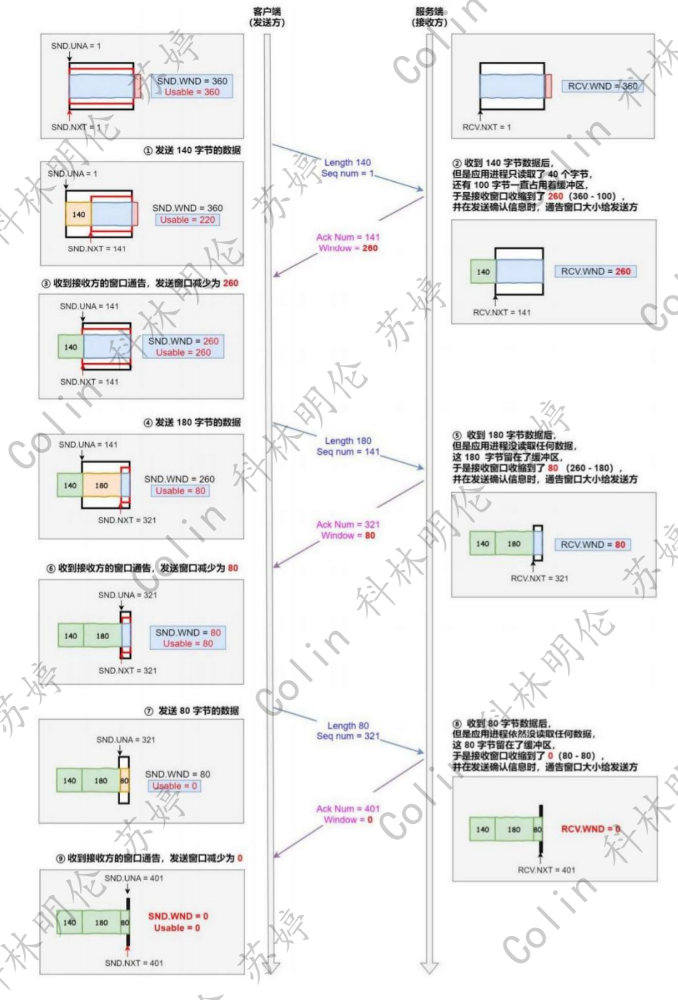
- 滑动窗口大小变为0以后，会导致阻塞住，不发送数据
- 如果应用进程没有及时处理接收到的数据，那么就告诉发送端别发送那么多数据过来了。等到接收端应用进程处理了接收到的数据以后，再通知发送端继续发送数据。通过这种方式实现流量控制


#### 粘包问题

- TCP是基于字节流的传输，是一种没有边界的传输数据方式。能合并就要能拆开，拆不开就会粘包
- 解决办法
    - 设置标志位（起始/结束标志位）
    - 固定包大小
    - 先发送数据长度，然后再发包
    - 短连接

#### 心跳机制

- 定时发送一个自定义的结构体（心跳包），让对方知道自己还活着，以确保连接的有效性的机制
- 应用场景
    - 在长连接下，有可能很长一段是都没有数据往来。理论上，这个连接一直保持连接的，但是实际上，中间节点出现什么故障是难以预测的，更要命的是，有的防火墙会自动把一定时间内没有数据交互的连接给断掉。这个时候就需要心跳包，用于维持长连接，保活
- 每隔几分钟发送一个固定的信息给服务端，服务端收到后回复一个固定的信息。如果服务端几分钟内没有收到客户端信息则视作客户端断开连接
    - 一般的应用判定时间在30-40秒 要求高的6-9秒
- 实现技术
    - 应用层自己实现的心跳包
        - 服务器每隔一定时间向客户端发哦是那个一个短小的数据包，然后启动一个线程，在线程中不断检测客户端的回应，如果一定时间内没有客户端的回应，即认为客户端掉线；同样客户端一定时间呢没有收到服务端的心跳包，则认为连接不可用
    - 使用SO_KEEPALIVE套接字选项
        - 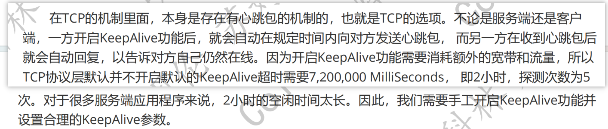

#### Nagle算法

- 为了尽可能发送大块数据，避免网络中充斥着许多小数据块
- 算法的思路是延时处理，满足以下两个条件中的一条才可以发送数据：
- 没有已发送未确认报文时，立刻发送数据。
- 存在未确认报文时，直到「没有已发送未确认报文」或「数据长度达到 MSS 大小」时，再发送数据。
- 规则
    - 包长度达到MSS（最大报文长度），则允许发送
    - 如果该包含有FIN，则允许发送
    - 设置了TCP_NODELAY选项，则允许发送
    - 设置了TCP_CORK选项时，若所以发送去的小数据包（长度小于MSS）均被确认，则允许发送
        - 说明网络不拥塞，小数据包发就发吧
    - 上述条件都未满足，但发生了超时（一般为２０ｍｓ），则立即发送

- Nagle算法默认是打开的，如果对于一些需要小数据包交互的场景程序，比如telnet 或 ssh这样的交互性比较强的程序，则需要关闭Nagle算法。
    - 关闭算法的方法： int value = 1; setsockopt(sock_fd,IPPROTO_TCP,TCP_NODELAY,(char*)&value,sizeof(int));

#### 拥塞控制

- 网络中的链路容量和交换节点中的缓存和处理及都有着工作极限，当网络的需求超过他们的工作极限时，就出现了拥塞。在网络出现拥塞时，如果继续发送大量数据包，可能导致数据报延时丢失，这时tcp重传数据，一旦重传就会导致网络的负担更重，于是导致更大的延迟以及更多的丢包，这个情况就会进入恶性循环
- 拥塞控制是快速传输的基础
- 拥塞控制是一个全局性的过程，而流量控制是一个端到端的控制
    - 发送数据的大小取决于两者中最小的
- 发送方维持一个叫做拥塞窗口（cwnd）的状态变量，大小取决于网络的拥塞程度，并且动态的在变化。
    - 下面的举例以报文段的个数说明，但是实际上，拥塞窗口的大小是以字节为单位的
- 拥塞控制算法

##### 慢开始

- 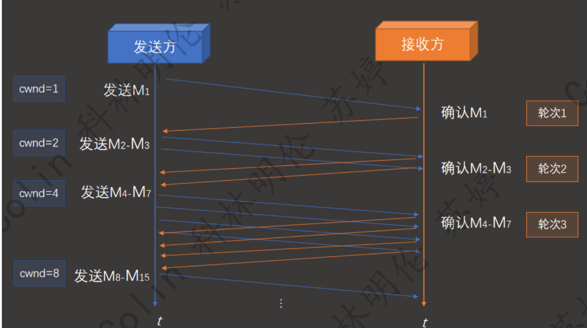	
- 慢开始思路：不要一开始就发送大量数据，先探测一下网络的拥塞程度，也就是由小到大逐渐增加拥塞窗口的大小
    - 每经过一个传输轮次，拥塞窗口cwnd就加倍
- 为了防止cwnd增长过大引起网络拥塞，还需要设计一个慢开始门限ssthresh状态变量
    - cwnd < ssthresh
        - 慢开始算法
            - 下次加倍大于ssthresh时，则下次传输为ssthresh个
    - cwnd > ssthresh
        - 拥塞避免算法
    - cwnd = ssthresh
        - 满开始与拥塞避免算法都行

##### 拥塞避免

- 让拥塞窗口缓慢增长，每经过一个往返时间RTT就把发送方的拥塞窗口+1。这样拥塞窗口按线性规律缓慢增长
- 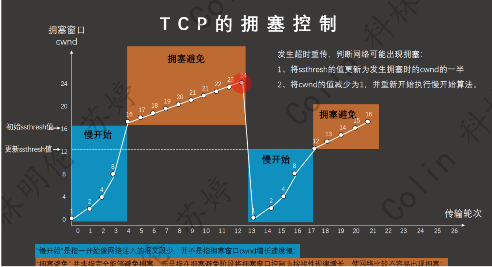
- 无论是慢开始阶段还是在拥塞避免阶段，只要发送方判断网络出现拥塞（根据就是没有收到确认，虽然没有收到确认可能是其他原因，但是无法判定，所以都当作拥塞控制处理），就把慢开始门限设置为出现拥塞是的发送窗口的大小的一半。然后把拥塞窗口窗口设置为1，执行慢开始算法

##### 快重传

- 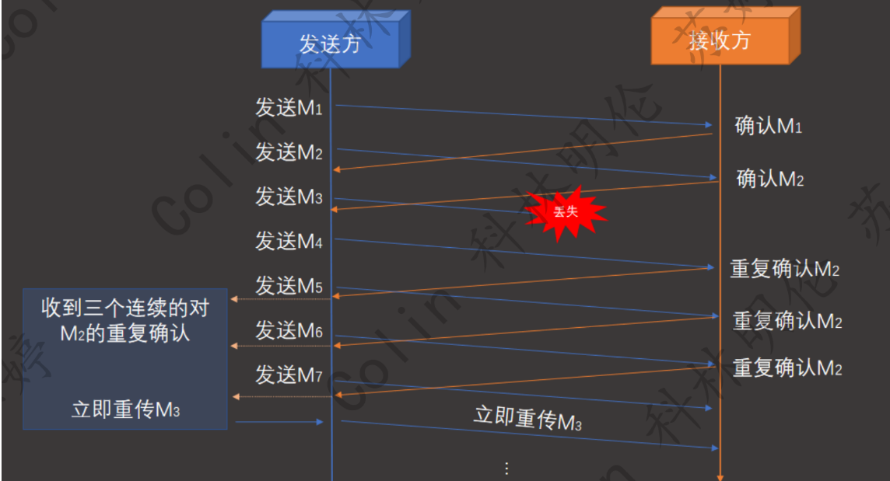	
- 快重传要求接收方在收到一个失序的报文段后就立即发出重复确认（为的是使发送发及早知道有报文段没有到达对方）而不是要等到自己发送数据时捎带确认。快重传算法规定，发送方只要一连收到三个重复确认就应当立即重传对方尚未收到的报文段，而不必继续等待设置的重传计时器时间到期。

##### 快恢复

- 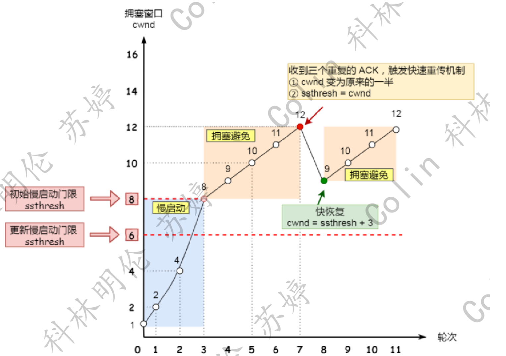	
- 当发送方连续收到三个重复确认时，把ssthresh门限减半。但是接下去并不执行慢开始算法。
- 考虑到如果网络出现拥塞的话就不会收到好几个重复的确认，所以发送方现在认为网络可能没有出现拥塞。所以此时并不执行慢开始算法，而是将cwnd设置为ssthresh的大小，然后执行拥塞避免算法
- 此处cwnd = ssthresh + 3，是因为发送方连续收到三个重复确认消息，所以cwnd = ssthresh以后又加上了3个重复确认消息
    - 既然发送方收到三个重复的确认，就表明有三个分组已经离开了网路。这三个分组不再消耗网络资源而是停留在接收方的缓存中。可见现在网络中并不是堆积了分组而是减少了三个分组。因此可以适当把拥塞窗口扩大些

- 当采用了快恢复算法时，慢开始算法只有在TCP建立连接时和网络超时才使用

- tcp和udp的比较
    - 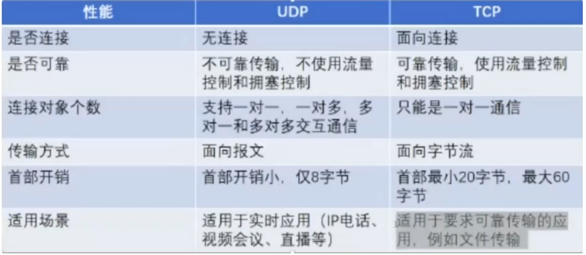	

- 可靠传输：seq和ack

##### 为什么TCP是可靠的

- 三次握手和四次挥手
- 重传和确认机制
- 合理的分段
- 校验重新排序
- 流量控制——滑动窗口
- 拥塞控制——4种拥塞控制算法

### UDP

- 头文件
    - \#include<winsock2.h>
- 依赖库
    - \#pragma comment(lib,"Ws2_32.lib")
- 服务端
    - 加载库
        - WORD mWord = MAKEWORD(2, 2); WSADATA mdata; int err = WSAStartup(mWord, &mdata); if (err != 0) { 	cout << "WSAStartup error" << endl; } if (2 != HIBYTE(mdata.wVersion) || 2 != LOBYTE(mdata.wVersion)) { 	cout << "WSAStartup WORD error" << endl; }
    - 创建套接字
        - ​	SOCKET sock = socket(AF_INET, SOCK_DGRAM, IPPROTO_UDP); if (INVALID_SOCKET == sock) { 	cout << "socket error:" << WSAGetLastError() <<endl; 		WSACleanup(); 		return 1; }
    - 绑定ip和端口
        - ​	struct sockaddr_in addrserver; addrserver.sin_family = AF_INET; addrserver.sin_port = htons(6666); addrserver.sin_addr.S_un.S_addr = INADDR_ANY; err = bind(sock, (sockaddr*)&addrserver, sizeof(addrserver)); if (SOCKET_ERROR == err) { 	cout << "bind error:" << WSAGetLastError() << endl; 		closesocket(sock); 		WSACleanup(); 	return 1; } cout << "WSAStartup,socket,bind sucess" << endl;
    - 接受数据
        - mRecv = recvfrom(sock, recvBuf, sizeof(recvBuf), 0, (sockaddr*)&addrclient, &addrclientsize); 	if (mRecv > 0) { 		cout << "ip:" << inet_ntoa(addrclient.sin_addr) << "  buf:" << recvBuf << endl; 	} 	else if (mRecv == 0) { 		cout << "连接断开" << endl; 	} 	else { 		cout << "-----------" << endl; 	}
    - 处理数据
    - 发送数据
        - ​		mSend = sendto(sock, sendBuf, sizeof(sendBuf), 0, (sockaddr*)&addrclient, addrclientsize); 	if (SOCKET_ERROR == mSend) { 		cout << "sendto error" << WSAGetLastError() << endl; 	} 	else { 		cout << "sendto success" << endl; 	}
    - 关闭套接字
        - closesocket(sock);
    - 卸载库
        - WSACleanup();
- 客户端：没有绑定这一步
    - ```c++
        #include <iostream>
        #include <WinSock2.h>
        
        //依赖库
        #pragma comment(lib,"Ws2_32.lib")
        using namespace std;
        
        int main() {
        	//1，加载库
        	WORD mword = MAKEWORD(2, 2);
        	WSADATA mdata;
        	int err = WSAStartup(mword, &mdata);
        	if (err != 0) {
        		cout << "WSAStartup error" << endl;
        		return 1;
        	}
        	if (2 != HIBYTE(mdata.wVersion) || 2 != LOBYTE(mdata.wVersion)) {
        		cout << "WSAStartup WORD error" << endl;
        		return 1;
        	}
        	//2，创建套接字
        	SOCKET sock = socket(AF_INET, SOCK_DGRAM, IPPROTO_UDP);
        	if (INVALID_SOCKET == sock) {
        		cout << "socket error：" <<WSAGetLastError() << endl;
        
        		WSACleanup();
        
        		return 1;
        	}
        	cout << "WSAStartup,socket sucess" << endl;
        
        	struct sockaddr_in addrserver;
        	addrserver.sin_family = AF_INET;
        	addrserver.sin_port = htons(6666);
        	addrserver.sin_addr.S_un.S_addr = inet_addr("192.168.0.21");
        	int addrserversize = sizeof(addrserver);
        
        	char recvBuf[1024] = "";
        	char sendBuf[1024] = "";
        	int mRecv = 0;
        	int mSend = 0;
        
        	while (true) {
        		//3,发送消息
        		gets_s(sendBuf);
        		mSend = sendto(sock, sendBuf, sizeof(sendBuf), 0, (sockaddr*)&addrserver, addrserversize);
        		if (SOCKET_ERROR == mSend) {
        			cout << "sendto error" << WSAGetLastError() <<endl;
        		}
        		else {
        			cout << "sendto success" << endl;
        		}
        		//4，接收消息
        		memset(recvBuf, 0, sizeof(recvBuf));
        		mRecv = recvfrom(sock, recvBuf, sizeof(recvBuf), 0, 0, 0);
        		if (mRecv > 0) {
        			cout << "ip:" << inet_ntoa(addrserver.sin_addr) << "   recvBuf:" << recvBuf << endl;
        		}
        		//else if(mRecv == 0) {
        		//	cout << " 断开连接 " << endl;
        		//}
        		//else {
        		//	cout << "-------" << endl;
        		//}
        	}
        	//5，关闭套接字
        	closesocket(sock);
        	//6，卸载库
        	WSACleanup();
        	return 0;
        }
        ```
    
- udp中实现广播
    - 直接广播：指定一个网段发送数据，是可以跨路由器的，广播指定的网段。例如广播地址是192.168.3.255，就是192.168.3.xx的所有主机都会收到。
        - 我们把客户端中服务器的ip地址改成广播地址就可以
    - 有限广播
        - 像局域网中任意网段发送数据，发送地址是255.255.255.255，是不能跨路由器的，不然会引起广播风暴。简单将讲，就是广播数据充斥网络无法处理，并且占用大量网络带宽，导致正常业务不能运行，甚至直接彻底瘫痪
        - 有限广播需要一个广播权限，使用setsockopt设置，成功返回零，失败返回SOCKET_ERROR。
            - 第一个参数为要设置广播权限的socket
            - 第二个：SOL_SOCKET
            - 第三个：SO_BROADCAST
            - 第四个：BOOL类型数值，TRUE是设置广播权限 FALSE就是取消广播权限
            - 第五个：第四个参数的大小
            - BOOL bval = TRUE; setsocketopt(clientSock,SOL_SOCKET,SO_BROADCAST,(CHAR*)&bval,sizeof(bval));
            - 
- UDP数据包的特点
    - socket的阻塞与非阻塞
        -  阻塞：老王烧水，把水壶放在炉子上，就子旁边看着，这个期间什么也不干，直到开水结束
        - 非阻塞：老王烧水，把水放在炉子上，就去看电视了，每隔一段时间回来看看水烧没烧开，开了就结束，没开就再回去看电视
        - recvfrom是阻塞的，这是因为socket的原因，socket是阻塞的
        - socket默认是阻塞的
        - 设置socket为非阻塞的
            - 使用ioctlsocket函数，成功返回0，失败返回SOCKET_ERROR，WSAGetLastError()，可以查看错误代码 。
                - 第一个参数，socket
                - 要在套接字上执行的命令
                    - 改变套接字的阻塞状态
                - 执行cmd参数的指针，就是像执行的命令，阻塞还是非阻塞
        - 
        - 
        - u_long val = 1; ioctlsocket(sock,FIONBIO,&val);
        - 设置非阻塞后，会返回错误代码10035，说明请求的操作没有完成，这并不影响，若果收到数据就会返回正常的值了，错误提示不接受10035就好了
        - 非阻塞操作进程一直占用CPU，非阻塞就是牺牲CPU资源，然后提高进程响应。但是CPU占用率提高了以后，但其他进程的响应就会变慢
    - 发送缓冲区和接受缓冲区
        - 每创建一个socket，操作系统就会给这个socket分配一个发送缓冲区和一个接收缓冲区（在内核层分配）（64K）
            - sendto就是将数据发送到发送缓冲区中-------应用层执行
            - recvfrom是从内核层缓冲区（接收缓冲区），将数据复制到自己的缓冲区中（用户层）。
            - 数据包格式：|mac头|IP头|TCP头|数据|，其中TCP投中包含端口号，进程和这个端口号绑定，操作系统会监听到哪个端口来了数据，然后放到对应程序的内阁缓冲区中，进程调用recvfrom函数的时候，就会把数据从内核缓冲区赋值到自己的缓冲区也就是代码中的recvBUf中
        - getsockopt获取缓冲区的大小，成功返回0，失败返回SOCKET_ERROR
        - 
        - ​	int recvSize = 0; int sendSize = 0; int size = sizeof(int); getsockopt(sock,SOL_SOCKET, SO_RCVBUF,(char*)&recvSize,&size); getsockopt(sock,SOL_SOCKET, SO_SNDBUF,(char*)&sendSize,&size); cout << "recvSize:"<< recvSize  <<",recvSize:"<< sendSize  <<endl;
    - 发送的阻塞和非阻塞
        - 发送阻塞：当发送缓冲区空间不足够大的时候，等到发送缓冲区足够大在发送
        - 发送非阻塞：当发送缓冲区空间不足够大的时候，有多少空间就往里拷贝多少内容，剩下的数据应用程序自己处理，返回实际发送的数据大小
    - 接受的阻塞和非阻塞
        - 接受阻塞：没有数据一直等，直到等到数据才会往下执行
        - 接受非阻塞：一会查询数据到没到，若果有的话，继续执行向下的代码，没有的话等会再来查询一次
    - UDP数据包的特点
        - UDP数据报，只要有数据放入发送缓冲区，就直接发送出去，然后从缓冲区中删除，发送的数据不会在缓冲区中停留。这样，加入发送失败，就没有办法重新发送一遍了，因为数据已经从发送缓冲区里删除了
        - UDP数据报，数据不可差分，接到多少，剩下的丢弃
            - 当接发送端发送1000字节，接收端只接受100字节，那么剩下的数据将都被丢弃
        - 如果发送端发送字节数 < 接收端自定义缓冲大小，收到数据直接返回，有多少就接多少，不会等待缓冲区全部填满
    - UDP特点
        - 面向非连接，接收数据时，可以接收任意人发给我的数据，可以是1对1，也可以是1对多(广播，组播)
        - 通讯方式
            - 数据报文的通信方式，数据包不可拆分
        - 传输效率高（跟后面TCP比会更明显）
        - 会产生丢包，没有校验检查，也可能会出现乱序

### TCP

- 服务端
    - 头文件
        - \#include <WinSock2.h>
    - 依赖库
        - \#pragma comment(lib,"Ws2_32.lib")
    - 加载库
        - ​	WORD mword = MAKEWORD(2, 2); WSADATA mdata; int err = WSAStartup(mword, &mdata); if (err != 0) { 	cout << "WSAStart error" << endl; 	return 1; } if (2 != HIBYTE(mdata.wVersion) || 2 != LOBYTE(mdata.wVersion)) { 	cout << "WSAStartup data" << endl; 	return 1; }
    - 创建套接字
        - ​	SOCKET listensock = socket(AF_INET, SOCK_STREAM, IPPROTO_TCP); if (INVALID_SOCKET == listensock) { 	cout << "listensock error：" << WSAGetLastError() << endl; 		WSACleanup(); 	return 1; }
    - 绑定ip和端口
        - ​	struct sockaddr_in addrserver; addrserver.sin_family = AF_INET; addrserver.sin_port = htons(6666); addrserver.sin_addr.S_un.S_addr = INADDR_ANY; 	err = bind(listensock, (sockaddr*)&addrserver, sizeof(addrserver)); if (SOCKET_ERROR == err) { 	cout << "bind error:" << WSAGetLastError() << endl; 		closesocket(listensock); 	WSACleanup(); 	return 1; }
    - 监听
        - ​	err = listen(listensock, 128); if (SOCKET_ERROR == err) { 	cout << "listen error:" << WSAGetLastError() << endl; 	closesocket(listensock); 	WSACleanup(); 	return 1; }
    - 接受连接
        - ​		client_sock = accept(listensock, (sockaddr*)&addrclient, &addrclientsize); 	if (INVALID_SOCKET == client_sock) { 		cout << "client error" << endl; 		continue; 	}
    - 接收数据
        - ​			recvSize = recv(client_sock, recvBuf, sizeof(recvBuf), 0); 		if (recvSize > 0) { 			cout << "recvBuf:" << recvBuf << endl; 		} 		else if(recvSize == 0) { 			cout << "正常断开连接" << endl; 		}
    - 发送数据
        - ​			gets_s(sendBuf); 		sendSize = send(client_sock, sendBuf, sizeof(sendBuf), 0); 		if (SOCKET_ERROR == sendSize) { 			cout << "send error:"<< WSAGetLastError() << endl; 			break; 		}
    - 关闭套接字
        - closesocket(listensock);
    - 卸载库
        - WSACleanup();
    - 完整代码
        - ```c++
            #include <iostream>
            #include <WinSock2.h>
            
            #pragma comment(lib,"Ws2_32.lib")
            using namespace std;
            
            int main() {
            	//1，加载库
            	WORD mword = MAKEWORD(2, 2);
            	WSADATA mdata;
            	int err = WSAStartup(mword, &mdata);
            	if (err != 0) {
            		cout << "WSAStart error" << endl;
            		return 1;
            	}
            	if (2 != HIBYTE(mdata.wVersion) || 2 != LOBYTE(mdata.wVersion)) {
            		cout << "WSAStartup data" << endl;
            		return 1;
            	}
            	//2，创建套接字
            	SOCKET listensock = socket(AF_INET, SOCK_STREAM, IPPROTO_TCP);
            	if (INVALID_SOCKET == listensock) {
            		cout << "listensock error：" << WSAGetLastError() << endl;
            
            		WSACleanup();
            		return 1;
            	}
            	//3，绑定ip和端口
            	struct sockaddr_in addrserver;
            	addrserver.sin_family = AF_INET;
            	addrserver.sin_port = htons(6666);
            	addrserver.sin_addr.S_un.S_addr = INADDR_ANY;
            
            	err = bind(listensock, (sockaddr*)&addrserver, sizeof(addrserver));
            	if (SOCKET_ERROR == err) {
            		cout << "bind error:" << WSAGetLastError() << endl;
            
            		closesocket(listensock);
            		WSACleanup();
            		return 1;
            	}
            	//4，监听
            	err = listen(listensock, 128);
            	if (SOCKET_ERROR == err) {
            		cout << "listen error:" << WSAGetLastError() << endl;
            		closesocket(listensock);
            		WSACleanup();
            		return 1;
            	}
            	cout << "WSAStartup,socket,bind,listen success" << endl;
            	char recvBuf[1024] = "";
            	char sendBuf[1024] = "";
            	int recvSize = 0;
            	int sendSize = 0;
            	struct sockaddr_in addrclient;
            	int addrclientsize = sizeof(addrclient);
            	SOCKET client_sock;
            	while (true) {
            		//5，接受连接
            		client_sock = accept(listensock, (sockaddr*)&addrclient, &addrclientsize);
            		if (INVALID_SOCKET == client_sock) {
            			cout << "client error" << endl;
            			continue;
            		}
            		while (true) {
            			//6，接收数据
            			recvSize = recv(client_sock, recvBuf, sizeof(recvBuf), 0);
            			if (recvSize > 0) {
            				cout << "recvBuf:" << recvBuf << endl;
            			}
            			else if(recvSize == 0) {
            				cout << "正常断开连接" << endl;
            			}
            			//7，发送数据
            			gets_s(sendBuf);
            			sendSize = send(client_sock, sendBuf, sizeof(sendBuf), 0);
            			if (SOCKET_ERROR == sendSize) {
            				cout << "send error:"<< WSAGetLastError() << endl;
            				break;
            			}
            		}
            		closesocket(client_sock);
            	}
            	//8，关闭套接字
            	closesocket(listensock);
            	//9，卸载库
            	WSACleanup();
            
            	return 0;
            }
            ```
        
    
- 客户端：没有绑定和监听，接受连接，但是多了一个连接connect
    - ​	err = connect(sock, (sockaddr*)&addrserver, sizeof(addrserver)); if (SOCKET_ERROR == err) { 	cout << "connect error:" << WSAGetLastError() << endl; 	closesocket(sock); 	WSACleanup(); 	return 1; }
    - 完整代码
        - ```c++
            #include <iostream>
            #include <WinSock2.h>
            
            #pragma comment(lib,"Ws2_32.lib")
            
            using namespace std;
            
            int main() {
            	//1，加载库
            	WORD mword = MAKEWORD(2, 2);
            	WSADATA mdata;
            	int err = WSAStartup(mword, &mdata);
            	if (err != 0) {
            		cout << "WSAStartup error" << endl;
            		return 1;
            	}
            	if (2 != HIBYTE(mdata.wVersion) || 2 != LOBYTE(mdata.wVersion)) {
            		cout << " WSAStartup WORD error" << endl;
            		return 1;
            	}
            	//2，创建套接字
            	SOCKET sock = socket(AF_INET, SOCK_STREAM, IPPROTO_TCP);
            	if (INVALID_SOCKET == sock) {
            		cout << "socket error:"<< WSAGetLastError() << endl;
            		WSACleanup();
            		return 1;
            	}
            	//3，连接
            	struct sockaddr_in addrserver;
            	addrserver.sin_family = AF_INET;
            	addrserver.sin_port = htons(6666);
            	addrserver.sin_addr.S_un.S_addr = inet_addr("192.168.241.1");
            	err = connect(sock, (sockaddr*)&addrserver, sizeof(addrserver));
            	if (SOCKET_ERROR == err) {
            		cout << "connect error:" << WSAGetLastError() << endl;
            		closesocket(sock);
            		WSACleanup();
            		return 1;
            	}
            	cout << " WSAStartup,socket,connect success" << endl;
            
            	char recvBuf[1024] = "";
            	char sendBuf[1024] = "";
            	int recvSize = 0;
            	int sendSize = 0;
            
            	while (true) {
            		//4，发送数据
            		gets_s(sendBuf);
            		sendSize = send(sock, sendBuf, sizeof(sendBuf), 0);
            		if (SOCKET_ERROR == sendSize) {
            			cout << "send error:" << WSAGetLastError() << endl;
            			continue;
            		}
            		//5，接受数据
            		memset(recvBuf, 0, sizeof(recvBuf));
            		recvSize = recv(sock, recvBuf, sizeof(recvBuf), 0);
            		if (recvSize > 0) {
            			cout << "recvBuf:" << recvBuf << endl;
            		}
            		else if(recvSize == 0){
            			cout << "正常断开连接" << endl;
            			break;
            		}
            		else {
            			cout << "recv error:" << WSAGetLastError() << endl;
            			break;
            		}
            	}
            	//6，关闭套接字
            	closesocket(sock);
            	//7，卸载库
            	WSACleanup();
            	return 0;
            }
            
            ```
        
            

### 协议：

网络计算机的终端间要想正确的传输信息和数据,必须在数据传输的顺序,数据格式和内容等方面,有一个约定或规则,这种约定或规则,称之为协议
序列化 反序列化：
struct Node n;
char *buf = new char [nlen]；
json
protobuf

### IP地址

·P地址(Internet Protocol Address)是指互联网协议地址，又译为网际协议地址
IP地址是IP协议提供的一种统一的地址格式，它为互联网上的每一个网络和每一台主机分配一个逻辑地址，以此来屏蔽物理地址的差异。
[101.100.0.0 ,101.100.0.255 ]黑河
[101.100.1.0 ,101.100.1.255 ]牡丹江
[101.100.2.0 ,101.100.2.255 ]佳木斯
查归属地：将有边界变为int值，排序，每个值都对应一个归属地，则找到第一个比他小的前面的一个

##### 非阻塞发送问题：

循环发送

非阻塞，每次写一部分，多个线程向缓冲区写入资源，数据会乱套。加锁，但是一个套接字的满了，全部锁上不合理，考虑每个套接字加锁注册可写时事件，当可写时发送，但是可写事件到来也会发生争抢

可以写个队列，向队列内写入数据，可写事件到来时，从队列中发送数据

epoll模型

epoll是IO同步模型，但是可以异步处理（线程池）

### HTTP

http 请求由三部分组成，分别是:请求行、消息报头、请求正文

HTTP(超文本传输协议)是一个基于请求与响应模式的、无状态的、应用层的协议，常基于 TCP 的连接方式，HTTP1.1版本中给出一种持续连接的机制，绝大多数的Wep 开发，都是构建在 HTP 协议之上的Web 应用。

#### 1、常用的 HTTP 方法有哪些?

GET:用于请求访问已经被 URI(统一资源标识符)识别的资源，可以通过 URL传参给服务器。（get请求没有中文，有中文其实是浏览器显示）

http://baike.com?key=100&timestamp=16....

https://baike.sogou.com/v55601.htm?fromTite=%E7%99%BE%E5%AE%B6%E5%A7%93

POST:用于传输信息给服务器，主要功能与 GET方法类似，但一般推荐使用 POST 方式。

PUT:传输文件，报文主体中包含文件内容，保存到对应 URI位置:
HEAD:获得报文首部，与 GET方法类似，只是不返回报文主体，一般用于验证 URI是否有效,

DELETE:删除文件，与 PUT方法相反，删除对应 URI位置的文件。

OPTIONS:查询相应 URI支持的 HTTP 方法。

#### 2.GET方法与 POST方法的区别

区别一:
get 重点在从服务器上获取资源，post 重点在向服务器发送数据:

区别二:
get 传输数据是通过 URL请求，以 feld(字段)= value 的形式，置于 URL 后，并用"?"连接，多个请求数据间用"&"连接，如 htp://127.0.0.1/Testlogin.action?name=admin&password=admin，这个过程用户是可见的:
post 传输数据通过 Htp的 post 机制，将字段与对应值封存在请求实体中发送给服务器，这个过程对用户是不可见的;

区别三:
Get 传输的数据量小，因为受URL 长度限制，但效率较高;Post 可以传输大量数据，所以上传文件时只能用 Post 方式:

区别四:
get是不安全的，因为URL是可见的，可能会泄露私密信息，如密码等;post 较 get 安全性较高;

区别五:

get 方式只能支持 ASCI 字符，向服务器传的中文字符可能会乱码。
post 支持标准字符集，可以正确传递中文字符。

#### 3、HTTP 请求报文与响应报文格式

请求报文包含三部分
a、请求行:包含请求方法、URI、HTTP 版本信息
b、请求首部字段
C、请求内容实体
响应报文包含三部分
a、状态行:包含 HTTP 版本、状态码、状码的原因短语
b、响应首部字段
c、响应内容实体

#### 4.常见的 HTTP 相应状态码

返回的状态
1xx:指示信息-表示请求已接收，继续处理
2xx:成功--表示请求已被成功接收、理解、接受

3xx:重定向--要完成请求必须进行更进一步的操作

4xx:客户端错误--请求有语法错误或请求无法实现

5xx：服务器端错误-服务器未能实现合法的请求

200:请求被正常处理

204:请求被受理但没有资源可以返回
206:客户端只是请求资源的一部分，服务器只对请求的部分资源执行 GET方法，相应报文中通过
Content-Range 指定范围的资源。
301:永久性重定向
302:临时重定向

#### 5、HTTP1.1 版本新特性

a、默认持久连接节省通信量，只要客户端服务端任意一端没有明确提出断开 TCP 连接，就一直保持连接，可以发送多次 HTTP 请求
b、管线化，客户端可以同时发出多个 HTTP 请求，而不用一个个等待响应
c、断点续传原理

https有握手环节

#### HTTP请求报文与响应报文格式

Cookie 和 Session 有什么区别?
1、由于HTTP协议是无状态的协议，服务端需要记录用户的状态时，就需要用某种机制来识具体的用户，
这个机制就是Session.典型的场景比如购物车。
当你点击下单按钮时，由于HTTP协议无状态，所以并不知道是哪个用户操作的，所以服务端要为特定的用户创建特定的Session,用于标识用户，跟踪用户，才知道购物车里有几本书。Session是保存在服务端的，有唯一标识。在服务端保存Session的方法很多，如内存、数据库、文件集群的时候也要考虑Session的转移，在大型的网站，一般会有专门的Session服务器集群，用来保存用户会话，此时 Session 信息都是放在内存的，使用缓存服务比如Memcached之类的来放Session

2、那么服务端如何识别特定的客户? Cookie就登场了。每次HTTP请求的时候，客户端都会发送相应的Cookie信息到服务端。实际上大多数的应用都是用 Cookie来实现Session跟踪的，第一次创建Session的时候，服务端会在HTTP协议中告诉客户端，需要在 Cookie里面记录一个Session ID，以后每次请求把这个会话ID发送到服务器，我就知道你是谁了。有人问，如果客户端的浏览器禁用了Cookie 怎么办?一般这种情况下，会使用一种叫做URL重写的技术来进行会话跟踪，即每次HTTP交互， URL后面都会被附加上一个诸如sid=xxxxx这样的参数，服务端据此来识别用户。

3、Cookie其实还可以用在一些方便用户的场景下，设想你某次登陆过一个网站，下次登录的时候不想再次输入账号了，怎么办?这个信息可以写到Cookie里面，访问网站的时候网站页面的脚本可以读取这个信息，就自动帮你把用户名给填了，能够方便一下用户。这也是Cookie名称的由来，给用户的一点甜头。
所以，总结一下:
Session是在服务端保存的一个数据结构，用来跟踪用户的状态，这个数据可以保存在集群、数据库、文件中。
Cookie是客户端保存用户信息的一种机制，用来记录用户的一些信息，也是实现Session的一种方式。

### https ssl 握手全过程

dns协议 arp协议 ftp协议

谈谈你了解的计算机安全或者网络安全?
加密(对称式加密非对称式加密) 解密
https  ssI握手
wlan拦截  app异地登录  网络欺诈 arp欺诈  恶意攻击

安全：wifi无密码泄漏信息，万能钥匙泄漏，usb口充电

分布式和负载均衡
负载均衡
nginx服务器  反向代理的负载均衡
正向代理   反向代理
LVS负载均衡 - NAT DR TUN

高可用：

ping：ICMP协议TCP族中，

ICMP网络控制信息协议，

三个方面：

错误：TTL超时，目标不可达

网络检测：ping 回显（发什么返回什么）

控制：拥塞控制发送抑制信息


