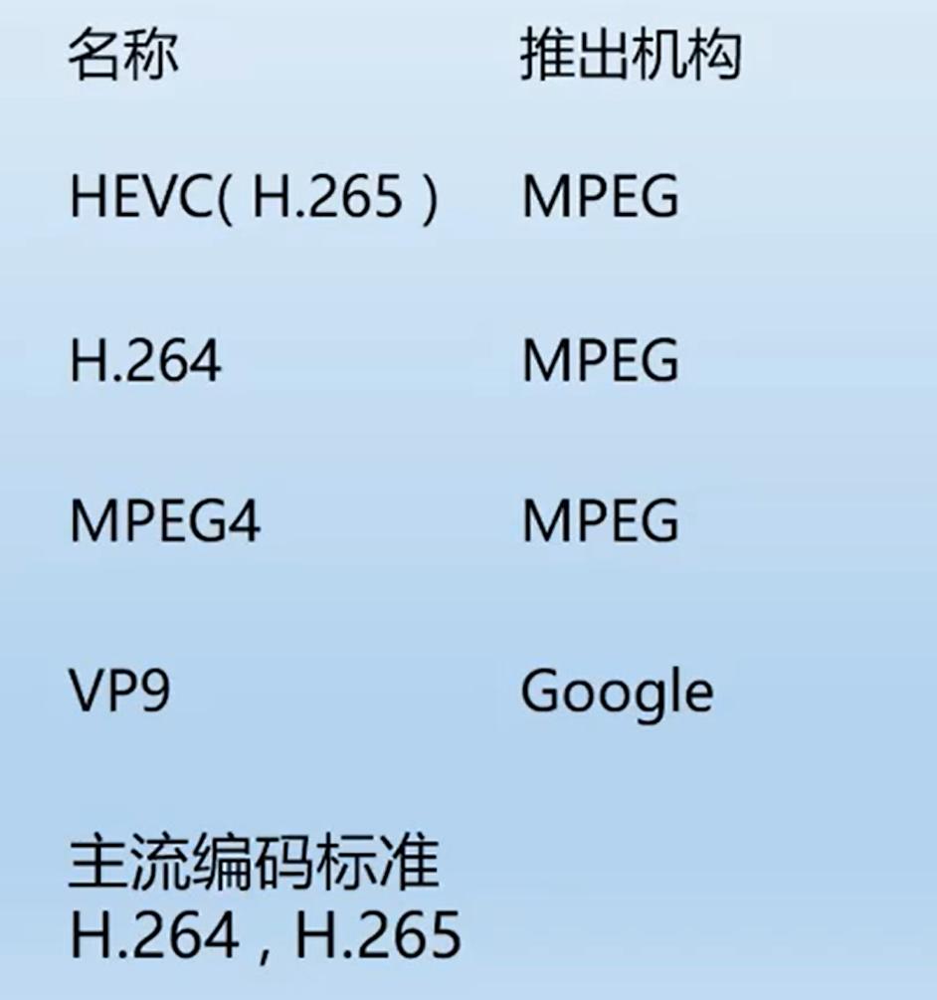

# 音视频

### 视频基础知识

**视频：连续时间内播放连续的画面，只要切换的画面频率足够高，由于人眼的惰性，会认为画面是移动的**

**帧率：1秒25或30张画面，这个数字叫帧率，fps。帧率的多少会影响，画面观看的连续度，同时会使文件大小变大**

视频的帧率和显示器的分辨帧率，动态插帧，视频帧率小于显示器分辨率，通过动态插帧技术生成画面，让视频更连续

**分辨率：横向像素数和纵向像素数的乘积**

超清1080p也就是1920\*1080，也就是一画面长是1920像素，宽是1080像素，长宽可以形成一个平面空间，空间上有1920\*1080个像素点，比如一个像素点表示的（BMP或PNG），那么一个1080p的图片大小为4.14M（1920\*1080\*2）

### 视频播放器原理

#### 技术包括：

封装技术

视频压缩编码技术以及音频压缩编码技术

如果考虑到网络传输的话，还包括流媒体协议

#### 播放流程：视频播放器播放一个视频文件

解协议（来自网络需要）

解封装

解码

解码音视频

音视频同步

	

**解协议：将流媒体协议的数据，解析为标准的相应的封装格式数据**

网路协议HTTP，RTMP等。这些协议在传输音视频数据的同时，也会传输一些信令数据。这些信令数据包括对播放的控制（暂停，播放停止），挥着对网络状态的描述等。解协议的过程中会去除掉信令数据而只保留音视频数据。例如采用RTMP协议传输的数据，经过解解协议操作后，输出FLV格式的数据

**解封装：将输入的封装格式的数据，分离成音频，视频流压缩编码数据**

封装的格式有很多，例如MP4，MKV，RMVB，FLV，AVI等等。它的作用就是将已经压缩编码的视频数据和音频数据放到一起。\例如，FLV格式的数据，经过解封装操作后，输出H.264编码的视频码流和AAC编码的音频码流

**解码：将视/音频压缩编码的数据，解码成为非压缩的视频音频原始数据**

音频的压缩标准包含：AAC，MP3，AC-3等等。\视频的压缩解码标准包含H.264,MPEG2,h.265等等

通过解码压缩编码的是视频数据输出成为非压缩的颜色数据，例如YUV420P，RGB等等；

压缩编码的音频数据输出为非压缩的音频抽样数据，例如PCM数据

**音视频同步：根据解封装模块处理过程中获取到的参数信息，同步解码出来的视频和音频数据，并将视频和音频数据送至系统的显卡和声卡播放出来**

sdk非开源，ffmpeg开源

流媒体协议：RTSP+RTP（IPTV以及各大直播）（TCP+UDP），RTMP（TCP），HTTP（TCP）

封装格式：

H.264和H.265。H.265更高的压缩率更好的显示效果（画面）。H.264技术沉淀很成熟，兼容性好，市面上文件很多是H.264，265的老文件放不了

##### 视频编码：

**将视频像素数据（RGB，YUV等）压缩成为视频码流，从而降低视频的数据量**

	

##### 音频编码：

**将音频采集数据（PCM）压缩成为音频码流，从而降低音频的数据量**

	

编码(encode)：通过特定的压缩技术，将某个视频的视频流格式转换成另一种视频格式的视频流方式。

解码(decode)：通过特定的解压缩技术,将某个视频格式的视频流转换成另一种视频格式的视频流方式。

转码(transcode)：视频转码技术将视频信号从一种格式转换成另一种格式

#### 音视频基本概念 

##### 编码：

视频:YUV420/422->H264 RGB888->H264 YUV420->h263

音频:PCM( 原始)->AAC  	PCM(原始)->G726	PCM(原始)->G711

##### 转码

视频:改变分辨率(resolution)改变帧率(frame rate)改变比特率 等编码参数

音频:改变采用率(sample rate)改变通道数(channels)改变位宽(sample format)

封装(mux):复用，按一定格式组织原视音视频流

解封装(demux):解复用，按一定格式解析出原始音视频流

rtsp流:RTSP( Real Time Streaming Protocol )RFC2326，实时流传输协议，是TCP/IP协议体系中的一个 应用层协议。

rtmp流: Real Time Messaging Protocol(实时消息传输协议)，是adobe公司的协议

hls流:HLS 是Apple的动态码率自适应技术。主要用于PC和Apple终端的音视 频服务。包括一个m3u8索引文件，TS媒体分片文件

推模式：当通知消息来之时，把所有相关信息都通过参数的形式“推给”观察者。

拉模式：当通知消息来之时，通知的函数不带任何相关的信息，而是要观察者主动去“拉”信息

实时流：Real Time stream 实时传输的音视频流

### 视频实战开发

##### 针对视频播放部分, 音频和视频的解码工具是FFMPEG, 对文件或网络资源进行解码视频的播放采用YUV数据转换为RGB, 绘图显示到控件（控件只支持RGB）

##### 为什么采用上面的解码工具? 

首先, 我们没有要完全手写一个解码h264的项目, 而是借用第三方开发库, 解码h264.

主流的h264编码器有 x264 t264等

对于新手来说，由于对h.264不是很了解，因此在使用x264上有点困难，出了问题通常

不知道如何解决。并且这些库都只能编码一种格式，所以一开始不推荐使用。

而是推荐使用FFMPEG。

FFMPEG是一个集成了各种编解码器的库，可以说是一个全能型的工具，从视频采集、

视频编码到视频传输（包括RTP、RTCP、RTMP、RTSP等等协议）都可以直接使用

FFMPEG来完成，更重要的一点FFMPEG是跨平台的，Windows、Linux、Android、

IOS这些主流系统通吃。因此初期强烈建议直接使用FFMPEG。

##### 引入ffmpeg 并试验：

```c++
//Qt Creator中修改工程配置文件 testFFmpeg.pro：在里面加入：
INCLUDEPATH += $$PWD/ffmpeg-4.2.2/include
LIBS += $$PWD/ffmpeg-4.2.2/lib/avcodec.lib\#a 音频 v 视频 av视音频 编解码器					
$$PWD/ffmpeg-4.2.2/lib/avdevice.lib\#设备，显示组件
$$PWD/ffmpeg-4.2.2/lib/avfilter.lib\#滤镜，图像的处理
$$PWD/ffmpeg-4.2.2/lib/avformat.lib\#主库，封装结构，mp4 ，读取，文件指针
$$PWD/ffmpeg-4.2.2/lib/avutil.lib\#基础包，数据结构包
$$PWD/ffmpeg-4.2.2/lib/postproc.lib\#后期处理，5版本以上现在不用了
$$PWD/ffmpeg-4.2.2/lib/swresample.lib\#转换的，重采样，视频，声音的转换
$$PWD/ffmpeg-4.2.2/lib/swscale.lib #缩放
./ --- $$PWD
引入头文件
extern "C"
{
#include "libavcodec/avcodec.h"
#include "libavformat/avformat.h"
#include "libswscale/swscale.h"
#include "libavdevice/avdevice.h"
}
//还要嫁给你dll文件打包放到exe文件同级目录下
//总结 : 
引入ffmpeg的过程
1.添加引入库
2.添加依赖路径
3.添加头文件
4.exe目录下添加dll文件
```

```c++
av_register_all();//注册所有组件，使用这个函数完成编码器和解码器的初始化，只有初始化了编码器和解码器才能正常使用，否则会在打开编解码器的时候失败。
avformat_open_input();//打开输入视频文件
avformat_find_stream_info();//获取视频文件信息
avcodec_find_decoder();//查找解码器
avcodec_open2();//打开解码器
av_read_frame();//输入文件读取一帧压缩数据
avcodec_decode_video2();//解码一帧压缩数据
avcodec_close();//关闭解码器
avformat_close_input();//关闭输入视频文件
```

##### FFmpeg数据结构简介

```c++
AVFormatContext:封装格式上下文结构体，也是统领全局的结构体，保存了视频文件封装格式相关信息。可以理解为一个指针
AVInputFormat:每种封装格式(例如FLV，MKV，MP4，AVI)对应一个该结构体。
AVStream:视频文件中每个视频(音频)流对应一个该结构体。
AVCodecContext:编解码器上下文结构体，保存了视频(音频)编解码相关信息
AVCodec:每种视频(音频)编解码器(例如H.264解码器)对应一个该结构体。
AVPacket:存储一帧压缩编码数据。
AVFrame:存储一帧解码后像素(采样)数据。
```

##### FFmpeg数据结构分析

```c++
AVFormatContext{//封装格式上下文结构体，也是统领全局的结构体，保存了视频文件封装格式相关信息。可以理解为一个指针
	iformat:输入视频的AVInputFormat
	nb_streams:输入视频的AVStream 个数
	streams:输入视频的AVStream[]数组
	duration:输入视频的时长(以微秒为单位)
	bit_rate:输入视频的码率
}
AVInputFormat{//每种封装格式(例如FLV，MKV，MP4，AVI)对应一个该结构体。
	name:封装格式名称
	long_name:封装格式的长名称
	extensions:封装格式的扩展名
	id:封装格式ID
	一些封装格式处理的接口函数
}
AVStream {//视频文件中每个视频(音频)流对应一个该结构体。
	id:序号
	codec:该流对应的AVCodecContext
	time_bise:该流的时基
	r_frame_rate:该流的帧率
}
AVCodecContext {//编解码器上下文结构体，保存了视频(音频)编解码相关信息
	codec:编解码器的AVCodec
	width，height:图像的宽高(只针对视频)
	pix_fmt:像素格式(只针对视频)
	sample_rate:采样率(只针对音频)
	channels:声道数(只针对音频)
	sample_fmt:采样格式(只针对音频)
}
AVCodec {//每种视频(音频)编解码器(例如H.264解码器)对应一个该结构体。
	name:编解码器名称
	long_name:编解码器长名称
	type:编解码器类型
	id:编解码器ID
	一些编解码的接口函数
}
AVPacket{//存储一帧压缩编码数据。
	pts:显示时间戳
	dts:解码时间戳
	data :压缩编码数据
	size :压缩编码数据大小
	stream_index:所属的AVStream
}
AVFrame{//存储一帧解码后像素(采样)数据。
	data:解码后的图像像素数据(音频采样数据)
	linesize:对视频来说是图像中一行像素的大小;对音频来说是整个音频帧的大小。
	width，height:图像的宽高(只针对视频)
	key_frame:是否为关键帧(只针对视频)
	pict_type:帧类型(只针对视频)。例如I，P，B.
}
```

##### 流程


1.初始化FFMPEG  	av_register_all

2.需要分配一个AVFormatContext,FFMPEG所有的操作都要通过这个AVFormatContext来进行可以理解为视频文件指针

3.打开视频文件 avformat_open_input()

3.1获取视频文件信息 avformat find stream info()

4.读取视频流

5.查找解码器Favcodec find decoder

5.1打开解码器 avcodec open2

6.申请解码需要的结构体 AVFrame 视频缓存的结构体

7.将解码后的YUV数据转换成RGB32	YUV420p 格式视频数据-->RGB32-->图片显示出来

8.循环读取视频帧,转换为RGB格式,抛出信号去控件显示

9.回收数据

### 简易同步

#### I帧：

|帧(Intra-coded picture,帧内编码帧，常称为关键帧)包含一幅完整的图像言息，属于帧内编码图像，不含运动矢量，在解码时不需要参考其他帧图像。因此在I帧图像处可以切换频频道，而不会导致图像丢失或无法解码。

#### P帧：

P帧(Predictive-coded picture,预测编码图像帧,常称为差异帧)是帧间编码帧，利用之前的I帧或P帧进行预测编码。

#### B帧：

B帧(Bi-directionally predicted picture,双向预测编码图像帧,常称为双向差异帧)是帧间编码帧,利用之前和(或)之后的I帧或P帧进行双向预测编码。B帧不可以作为参考帧。B帧具有更高的压缩率，但需要更多的缓冲时间以及更高的CPU占用率，因此B帧适合本地存储以及视频点播，而不适用对实时性要求较高的直播系统。

BST：显示时间戳		DTS：解码时间戳

同步采用PTS


#### 建议同步思路

在播放视频的时候,我们发现视频较快,会出现过快,与时间不同步,解决办法,每次解析的时候,都记录时间(显示时间戳)，然后判断当前视频的时间，比较真实时间和显示时间,(该方法下,视频会超前)，一旦显示时间更大,那么就等一下(msleep(10)),从而解决视频与时间不同步的问题。

也可以使用计时器，到达时间通知

### 音频背景知识

采样频率:每秒钟采样点的数量, 一般人声至少要5kHz , CD唱片是44.1kHz , 无损声音是48kHz , 超过48kHz 人耳无法识别而无效

• 采样精度(位宽): 用多少位的数据来表示一个音频数据点, 一般有8位的, 有16位的, 一般最大也就32位, 位数越多, 精度越高, 那么采集的数据也就越真实

• 声道数: 采集声音是多少个通道, 单声道听个响, 双声道可以判断左右耳声音距离, 四声道可以知道前后左右上下位置, 声道越多, 数据翻倍

• 比特率(码率): 音频每秒的数据量, 单位kbps(每秒多少千位, 不是字节) , 计算举例: 以48kHz的采样频率, 16位位宽, 双声道为例那么就是1s 1个声道有48k的采样点, 每个采样点是2字节, 双声道比特率= 48*2*2*8 = 1536kbps

#### 引入SDL

用来录和播放声音，解码还是要用ffmpeg

SDL可以移值还可以跨平台

添加依赖路径以及引入库

```c++
将ffmpeg和SDL2拷贝到工程目录下，在工程的pro文件中加入：

INCLUDEPATH += $$PWD/ffmpeg-4.2.2/include\
               $$PWD/SDL2-2.0.10/include

LIBS += $$PWD/ffmpeg-4.2.2/lib/avcodec.lib\
        $$PWD/ffmpeg-4.2.2/lib/avdevice.lib\
        $$PWD/ffmpeg-4.2.2/lib/avfilter.lib\
        $$PWD/ffmpeg-4.2.2/lib/avformat.lib\
        $$PWD/ffmpeg-4.2.2/lib/avutil.lib\
        $$PWD/ffmpeg-4.2.2/lib/postproc.lib\
        $$PWD/ffmpeg-4.2.2/lib/swresample.lib\
        $$PWD/ffmpeg-4.2.2/lib/swscale.lib\
		$$PWD/SDL2-2.0.10/lib/x86/SDL2.lib
```

包含头文件

```c++
extern "C"
{
\#include "libavcodec/avcodec.h"
\#include "libavformat/avformat.h"
\#include "libavutil/pixfmt.h"
\#include "libswscale/swscale.h"
\#include "libavformat/avformat.h"
\#include "libavdevice/avdevice.h"
\#include <SDL.h>
}
```

注意事项 使用sdl 会提示main函数没有定义的错误

原因是 SDL_main.h中有如下一段话：

```c++
#if defined(SDL_MAIN_NEEDED) || defined(SDL_MAIN_AVAILABLE)
#define main SDL_main
#endif
解决办法
#undef main
int main(int argc, char *argv[])
{
}
```


